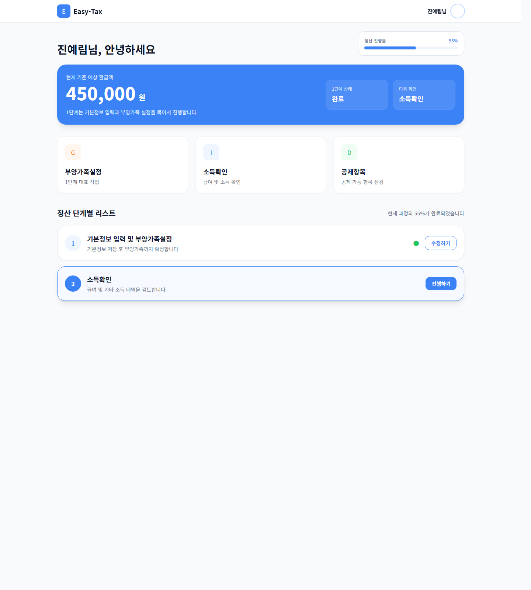
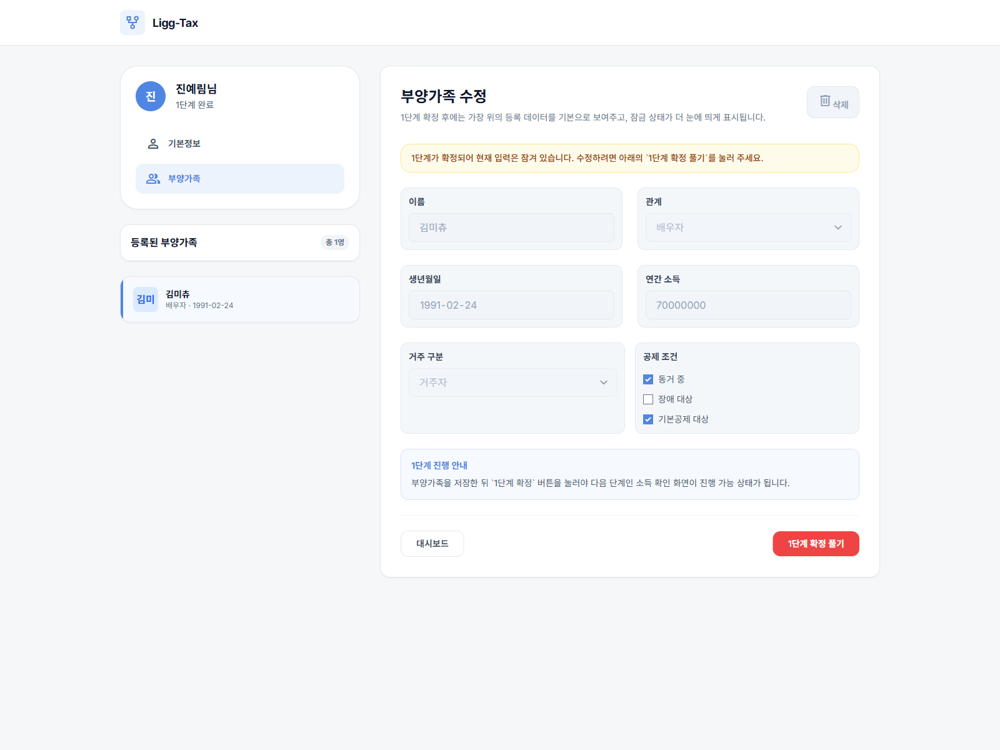
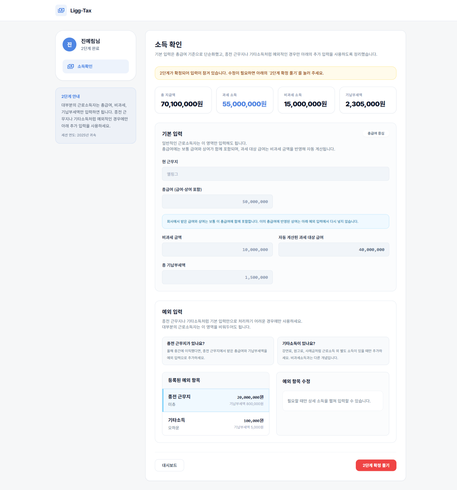
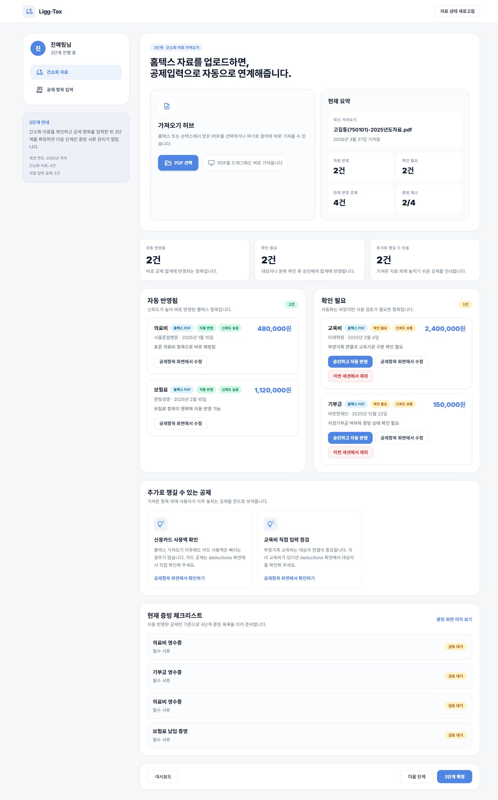
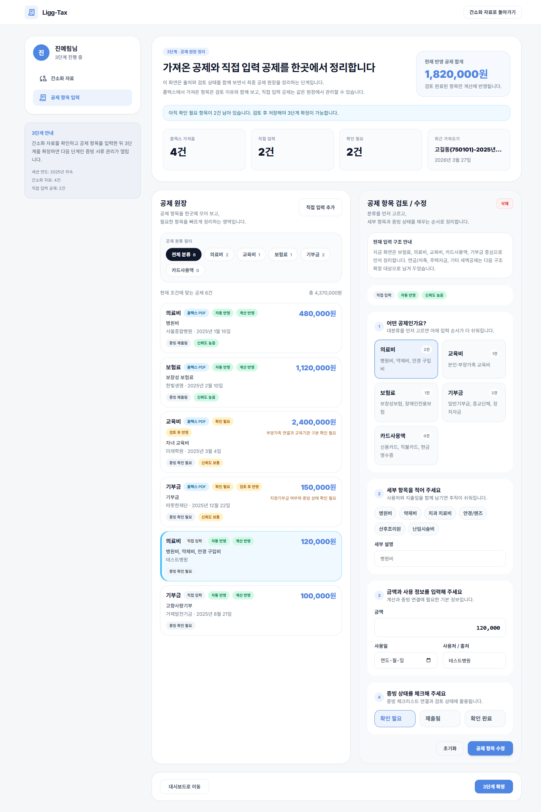

# 연말정산 모듈 프로젝트

Spring Boot 백엔드와 Next.js 프론트엔드로 구성된 연말정산 시뮬레이터입니다.  
사용자는 연말정산 세션을 기준으로 기본 정보, 부양가족, 소득, 간소화 자료, 공제항목, 증빙 서류, 계산 결과를 순서대로 확인하고 입력할 수 있습니다.

## 주요 화면

### 링텍스 대시보드


### 기본 정보 및 부양가족 입력


### 소득 입력


### 간소화 자료 가져오기


### 공제항목 입력


## 프로젝트 개요

- 목표: 연말정산 입력, 공제 검토, 증빙 확인, 계산 결과 확인까지 한 흐름으로 연결
- 세션 중심 구조: 모든 입력 데이터는 `tax_session` 기준으로 관리
- 현재 구현 초점: 실제 사용 가능한 UI 흐름, 백엔드 API, 룰셋 기반 계산 엔진, 하네스 검증 루프 연결
- 3단계 구조: 간소화 자료 가져오기와 공제항목 입력을 묶어서 검토 및 확정 흐름 제공

## 최근 구조 변화: 하네스 엔지니어링 구축

초기 버전은 화면 흐름과 CRUD/API 연결을 먼저 세우는 단순한 구조였습니다. 공제 계산도 각 정책 클래스 안의 상수와 조건문을 중심으로 동작했고, 세법 숫자와 구현 근거를 별도 산출물로 추적하는 장치는 약했습니다.

현재는 하네스 엔지니어링을 별도 운영 계층으로 구축했습니다. 하네스는 단순한 스크립트 묶음이 아니라, "무엇을 조사하고, 어떤 산출물을 남기고, 어떤 게이트를 통과해야 구현으로 들어갈 수 있는가"를 강제하는 실행 체계입니다. 공제 하나를 구현할 때 바로 코드를 수정하지 않고, 먼저 현재 구현 상태를 점검하고, 세법 ruleCode를 설계하고, 정규화 룰팩을 만든 뒤, 검증 게이트를 통과해야 계산 코드로 들어갑니다.

바뀐 핵심은 아래와 같습니다.

- **하네스 도입 전**
  - 공제별 구현을 개별 정책 클래스와 테스트 중심으로 진행
  - 세법 수치가 코드 상수에 직접 들어가는 경우가 많음
  - 공식 출처, ruleCode, diff, publish 여부를 한 흐름으로 강제하지 않음
  - 자동화가 없어 `docs/notes/command_list.md`의 절차를 사람이 직접 따라야 함

- **하네스 도입 후**
  - `plugins/year-end-harness/` 아래에 에이전트, 계약서, 템플릿, 검증 스크립트, 자동화 큐를 배치
  - `tax-expert`, `system-designer`, `fullstack-developer`, `qa-verifier`, `sdet-loop` 역할로 공제 구현 과정을 분리
  - 산출물 계약(`contracts/`)과 템플릿(`templates/`)을 통해 매번 같은 형식의 감사 가능한 결과물을 생성
  - `source-manifest.json`, `agent-a-tax-pack.md`, `normalized-rule-pack.json`, `diff-from-previous.md`로 세법 근거를 산출물화
  - `READY_FOR_REVIEW -> PUBLISHED` publish 경계를 명시해, 계산 엔진은 검토된 룰팩만 사용하도록 설계
  - `run-harness-gate.py`, `validate-artifacts.py`, 백엔드 회귀 스크립트로 구현 완료 판단을 자동 검증
  - `RuleSetResolver`, `ruleSnapshotHash`, 정규화 룰팩 기반 계산으로 하드코딩 의존도를 줄이는 방향으로 전환
  - `run-deduction-autopilot.cmd`와 `automation/backlog.json`으로 남은 공제 슬라이스를 우선순위대로 자동 처리 가능

즉 예전 설계가 "화면과 API를 먼저 연결한 연말정산 시뮬레이터"였다면, 지금 설계는 "공식 세법 소스, 룰팩, 계산 엔진, 에이전트 역할, 검증 게이트를 함께 관리하는 하네스 기반 연말정산 계산 시스템"에 가깝습니다.

## 하네스 엔지니어링 구성

하네스 엔지니어링의 목표는 반복 작업을 빠르게 만드는 것만이 아닙니다. 세법 기반 계산처럼 실수 비용이 큰 작업에서, 구현 전에 근거를 남기고, 구현 중에는 범위를 통제하고, 구현 후에는 검증 증거를 남기는 것입니다.

현재 하네스는 아래 레이어로 구성됩니다.

- **오케스트레이션 레이어**
  - `automation/backlog.json`으로 남은 공제 슬라이스를 큐처럼 관리
  - `one-shot-autopilot.md`로 "진행되지 않은 과정을 전부 구현"하는 원샷 실행 계약 정의
  - `inner-workflow.md`로 공제 1개를 `4-1 audit -> 4-2 design -> Gate 3 -> 4-3/3-4 -> 3-7 validation` 순서로 고정

- **도메인 전문가 레이어**
  - `agents/tax-expert.md`: 공식 세법 근거와 ruleCode 후보 검토
  - `agents/system-designer.md`: 입력, 매칭, 증빙, 결과 계산 설계
  - `agents/fullstack-developer.md`: 계산 엔진과 API 반영
  - `agents/qa-verifier.md`, `agents/sdet-loop.md`: 산출물 계약과 회귀 검증

- **산출물 계약 레이어**
  - `contracts/source-manifest-contract.md`: 공식 출처 목록과 확인 시각 기록
  - `contracts/normalized-rule-pack-contract.md`: 계산 엔진이 읽을 ruleCode/parameter 구조 고정
  - `contracts/validation-report-contract.md`: 구현 후 검증 결과 형식 고정
  - `templates/`: 각 phase 산출물의 기본 형식 제공

- **게이트와 승인 레이어**
  - `detect-missing-rulecode.py`: 구현 전 PUBLISHED 룰팩에 필요한 ruleCode가 있는지 확인
  - `prepare-phase1-reentry.py`: ruleCode가 없으면 Phase 1 재진입 산출물을 자동 생성
  - `approve-phase1-reentry.py`: 사람이 검토한 `READY_FOR_REVIEW` 룰팩을 정본 `PUBLISHED` 룰팩으로 게시
  - `run-harness-gate.py`: phase별 필수 산출물과 결과 블록 검증

이 구조 덕분에 하네스는 단순 문서가 아니라, 공제 구현의 "운영 체계"로 동작합니다. 다음 작업자가 들어와도 어디서 멈췄는지, 어떤 ruleCode가 필요한지, 어떤 검증을 통과했는지, 어떤 공제가 다음 순서인지 파일만 보고 이어갈 수 있습니다.

## 현재 구현 범위

- 인증
  - 로그인 / 회원가입
  - JWT 기반 인증
- 세션 흐름
  - 연말정산 세션 조회
  - 대시보드 단계별 진행 상태 표시
- 기본 정보 · 부양가족
  - 기본 정보 입력
  - 부양가족 등록 / 조회 / 수정 흐름
- 소득 입력
  - 소득 항목 CRUD
  - 금액 검증
  - 소득 합계 반영
- 간소화 자료 · 공제항목
  - 홈택스 PDF 업로드 UI
  - 공제항목 조회 / 수정 / 삭제 / 직접 입력
  - 자동 반영 / 확인 필요 구분
  - 문서 체크리스트 동기화
- 계산 / 제출
  - 공제 계산 결과 확인
  - 제출 상태 확인 화면
- 룰셋 기반 계산
  - 근로소득공제
  - 실제 종합소득 과세표준 세율표
  - 근로소득세액공제
  - 인적공제
  - PUBLISHED 룰팩 기반 ruleCode 추적
- 하네스 자동화
  - 공제 슬라이스 backlog 관리
  - Phase 1 재진입 산출물 생성
  - READY_FOR_REVIEW 룰팩 승인/게시 스크립트
  - 백엔드 회귀 검증 스크립트

## 간소화 자료 가져오기 현재 상태

- `POST /api/v1/tax-sessions/{sessionId}/deduction-items/imports/hometax` 업로드 API가 구현되어 있습니다.
- 현재는 PDF 업로드를 트리거로 샘플 공제항목을 생성하는 구조입니다.
- 즉 실제 PDF 텍스트 추출 / OCR / 표 파싱은 아직 붙어 있지 않습니다.
- 다만 아래 구조는 이미 준비되어 있습니다.
  - `deduction_items` 저장
  - `attributesJsonb` 메타데이터 저장
  - `document_checklists` 동기화
  - 자동 반영 / 확인 필요 UI 분기

## 저장 구조 메모

### `deduction_items`

공제항목 본체를 저장합니다.

- `deduction_type`
- `amount`
- `used_at`
- `source_name`
- `evidence_status`
- `attributesJsonb`

### `attributesJsonb`

가져오기 메타데이터를 JSONB로 저장합니다.

예시:

```json
{
  "sourceType": "HOMETAX",
  "sourceLabel": "홈택스 PDF",
  "entryChannel": "IMPORT_SYNC",
  "importBatchId": "550e8400-e29b-41d4-a716-446655440000",
  "importFileName": "고길동(750101)-2025년도자료.pdf",
  "importedAt": "2026-03-27T10:32:15+09:00",
  "importBucket": "AUTO_APPLIED",
  "reviewStatus": "APPROVED",
  "confidenceLevel": "HIGH",
  "reviewReason": "표준 의료비 항목으로 바로 매핑됨"
}
```

### `deduction_rules`

공제율, 한도, 조건 같은 세법 규칙을 담기 위한 테이블 의도로 시작했습니다.

현재는 이 방향이 더 구체화되어, Git 정본 룰팩과 계산 시점 스냅샷을 함께 쓰는 구조로 확장되었습니다.

- 세법 원문과 행정 가이드는 하네스 산출물로 정리합니다.
- 계산용 숫자는 `normalized-rule-pack.json`의 ruleCode와 parameters로 정규화합니다.
- 사람이 검토한 룰팩만 `PUBLISHED` 상태로 게시합니다.
- 계산 결과에는 ruleVersion뿐 아니라 스냅샷 해시와 ruleCode 추적 정보를 남기는 방향으로 보강하고 있습니다.

정본 룰팩 예시:

```text
plugins/year-end-harness/law-packs/2025/2025.01/normalized-rule-pack.json
```

## 하네스와 자동화

하네스 자동화는 위 엔지니어링 구조를 실제 실행으로 연결하는 레이어입니다. 예전에는 `docs/notes/command_list.md`의 명령을 사람이 복사해 단계별로 실행해야 했지만, 지금은 backlog와 원샷 계약을 통해 남은 공제 슬라이스를 자동으로 선택하고 같은 절차를 반복할 수 있습니다.

주요 파일:

- `docs/notes/command_list.md`: 사람이 보던 단계별 명령 목록과 우선순위
- `plugins/year-end-harness/automation/backlog.json`: 자동화가 처리할 공제 슬라이스 큐
- `plugins/year-end-harness/automation/inner-workflow.md`: 공제 1개를 처리하는 표준 절차
- `plugins/year-end-harness/automation/one-shot-autopilot.md`: "남은 과정을 전부 구현"하는 원샷 계약
- `plugins/year-end-harness/scripts/run-deduction-autopilot.cmd`: Windows 원샷 실행 스크립트

자동화 기본 실행:

```powershell
plugins\year-end-harness\scripts\run-deduction-autopilot.cmd --ralph
```

상태 확인:

```powershell
plugins\year-end-harness\scripts\run-deduction-autopilot.cmd --status
```

ruleCode가 없으면 자동화는 런타임 코드를 바로 만들지 않습니다. 먼저 같은 run-dir에 Phase 1 재진입 산출물을 만들고 `READY_FOR_REVIEW`에서 멈춥니다.

검토 후 게시:

```powershell
python plugins/year-end-harness/automation/scripts/approve-phase1-reentry.py --run-dir <멈춘-run-dir>
```

이 명령은 검토된 룰팩을 `plugins/year-end-harness/law-packs/<taxYear>/<ruleVersion>/` 아래에 `PUBLISHED`로 게시합니다.

## 기술 스택

### Frontend

- Next.js 16
- React 19
- Tailwind CSS

### Backend

- Java 21
- Spring Boot 3.5
- Spring Web
- Spring Security
- Spring Data JPA
- Spring Validation
- Springdoc OpenAPI

### Infra

- PostgreSQL
- Redis
- Docker Compose

## 디렉터리 구조

```text
year-end/
├─ backend/
│  └─ src/main/java/com/example/yearend
├─ frontend/
│  ├─ app/
│  └─ lib/
├─ docs/
│  ├─ analysis/
│  ├─ architecture/
│  ├─ guides/
│  ├─ notes/
│  ├─ references/
│  ├─ samples/
│  └─ images/
├─ plugins/
│  └─ year-end-harness/
│     ├─ agents/
│     ├─ automation/
│     ├─ contracts/
│     ├─ law-packs/
│     ├─ scripts/
│     └─ templates/
├─ scripts/
├─ AGENTS.md
├─ docker-compose.yml
└─ README.md
```

## 주요 화면 경로

- `/`
- `/dependents`
- `/income`
- `/import-data`
- `/deductions`
- `/evidence-docs`
- `/results`
- `/submit-status`

## 주요 API 예시

- `POST /api/v1/auth/signup`
- `POST /api/v1/auth/login`
- `GET /api/v1/users/me`
- `POST /api/v1/tax-sessions`
- `GET /api/v1/tax-sessions/{sessionId}/income-items`
- `POST /api/v1/tax-sessions/{sessionId}/income-items`
- `GET /api/v1/tax-sessions/{sessionId}/deduction-items`
- `POST /api/v1/tax-sessions/{sessionId}/deduction-items/imports/hometax`
- `GET /api/v1/tax-sessions/{sessionId}/document-checklists`

## 로컬 실행 방법

### 1. 인프라 실행

```bash
docker compose up -d
```

### 2. 백엔드 실행

```bash
cd backend
./gradlew bootRun
```

기본 주소:

- App: `http://localhost:8080`
- Swagger: `http://localhost:8080/swagger-ui.html`

### 3. 프론트엔드 실행

```bash
cd frontend
npm install
npm run dev
```

또는 배포 모드:

```bash
cd frontend
npm install
npm run build
npm run start
```

## 테스트 계정

- email: `yelingg@example.com`
- password: `08210821`

## 문서

- `docs/analysis/project-analysis.md`
- `docs/architecture/harness-engineering-design.md`
- `docs/architecture/year-end-simulator-blueprint.md`
- `docs/architecture/deduction-rule-engine-design.md`
- `docs/architecture/postgresql-erd-draft.md`
- `docs/architecture/api-spec-draft.md`

## 다음 작업 방향

- 실제 홈택스 PDF 파싱 고도화
- 남은 P0/P1 공제 슬라이스 자동화 처리
- 연금보험료공제, 사회보험료공제, 신용카드, 기부금 등 ruleCode publish 후 계산 연결
- 공제 대분류 / 세부항목 구조 확장
- 증빙 검토 흐름 고도화
- 프론트 결과 화면에 ruleCode, 한도, 공제율, 계산 근거를 더 명확히 노출
