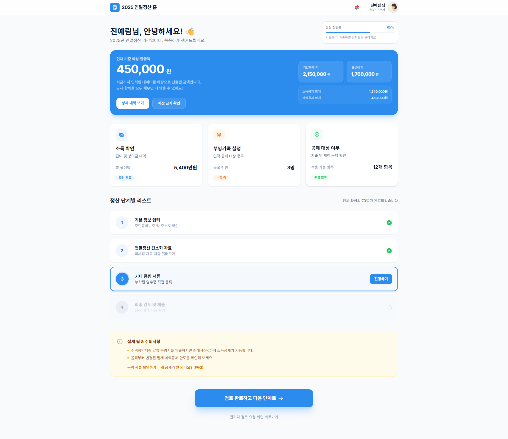
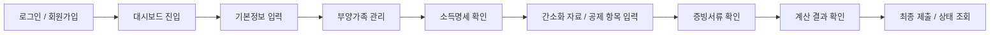
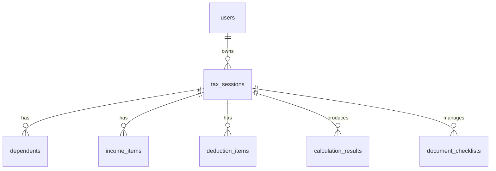

# 연말정산 모듈 프로젝트

Spring Boot 3.5 기반의 연말정산 시뮬레이터입니다.  
사용자는 `tax_session` 단위로 본인 정보, 부양가족, 소득, 공제 항목, 증빙 서류를 입력하고 예상 환급액과 세액 계산 결과를 확인할 수 있습니다.



## 프로젝트 개요

- 목표: 연말정산 입력부터 계산, 증빙 관리, 제출 상태 확인까지 하나의 흐름으로 연결
- 핵심 단위: 사용자 중심이 아닌 `tax_session` 중심 설계
- 설계 방향: 공제 규칙 판정과 세액 계산을 분리해 변경 대응성과 설명 가능성 확보
- 현재 UI: Spring Boot 정적 리소스 기반 10개 화면 구성

## 초기 구조

```text
year-end/
├─ backend/                  # Spring Boot 백엔드
│  ├─ src/main/java/com/example/yearend
│  └─ src/main/resources/static
├─ docs/                     # 설계 문서, ERD, API 초안, README 이미지
├─ scripts/                  # 보조 스크립트
├─ docker-compose.yml        # PostgreSQL / Redis / Backend 실행
└─ README.md
```

### 백엔드 패키지 구성

```text
com.example.yearend
├─ admin
├─ calculation
├─ common
├─ deduction
├─ document
├─ security
├─ taxsession
└─ user
```

## 주요 기능

- 로그인 / 회원가입 / JWT 기반 인증
- 연말정산 세션 생성 및 조회
- 기본정보 입력
- 부양가족 등록 및 관리
- 소득 항목 입력 및 조회
- 공제 항목 입력 및 규칙 기반 판정
- 증빙 서류 체크리스트 관리
- 예상 환급액 / 결정세액 / 소득공제 / 세액공제 결과 확인
- 제출 및 상태 조회 화면 제공
- 관리자 검토용 API 및 문서 상태 관리

## 화면 구성

현재 로컬에서 확인 가능한 화면은 아래 10개입니다.

| 화면 | 파일 |
| --- | --- |
| 인증 화면 | `auth.html` |
| 대시보드 화면 | `index.html` |
| 기본정보 입력 | `basic-info.html` |
| 부양가족 관리 | `dependents.html` |
| 소득명세 확인 | `income.html` |
| 간소화자료 불러오기 | `import-data.html` |
| 공제항목 입력 | `deductions.html` |
| 증빙서류 관리 | `evidence-docs.html` |
| 계산 결과 | `results.html` |
| 제출 / 상태조회 | `submit-status.html` |

## 사용자 프로세스



### 상세 흐름

1. 사용자가 회원가입 또는 로그인합니다.
2. 연말정산 세션을 생성하거나 기존 세션을 불러옵니다.
3. 기본정보와 신고 유형을 입력합니다.
4. 부양가족, 소득, 공제 항목을 순차적으로 입력합니다.
5. 증빙 서류 상태를 확인하고 누락 항목을 보완합니다.
6. 계산 엔진이 세액 및 환급 결과를 산출합니다.
7. 제출 후 상태를 조회하거나 관리자 검토를 진행합니다.

## 백엔드 설계 요약

### 핵심 구조

- `user`: 인증, 회원정보, 권한
- `taxsession`: 세션 생성, 기본정보, 부양가족, 소득 관리
- `deduction`: 공제 항목 입력, 규칙 엔진, 공제 판정
- `calculation`: 세액 계산, 결과 저장
- `document`: 증빙 서류 체크리스트
- `admin`: 제출 세션 검토, 문서 상태 관리

### 설계 포인트

- `DeductionPolicy` + `EligibilityChecker` 조합으로 공제 판정 분리
- `TaxCalculationService`에서 최종 세액 계산 전담
- `Money` 값 객체로 금액 연산 일관성 유지
- `ApiResponse` 기반 공통 응답 포맷 사용
- Spring Security + JWT + Stateless 세션 구조
- `GlobalExceptionHandler`로 검증 오류와 비즈니스 오류 일관 처리

### 주요 API 예시

- `POST /api/v1/auth/signup`
- `POST /api/v1/auth/login`
- `GET /api/v1/users/me`
- `POST /api/v1/tax-sessions`
- `POST /api/v1/tax-sessions/{sessionId}/dependents`
- `POST /api/v1/tax-sessions/{sessionId}/income-items`
- `POST /api/v1/tax-sessions/{sessionId}/deduction-items`
- `POST /api/v1/tax-sessions/{sessionId}/calculate`
- `GET /api/v1/tax-sessions/{sessionId}/results`

## DB 설계 요약

문서 기준 핵심 테이블은 아래 8개입니다.

- `users`
- `tax_sessions`
- `dependents`
- `income_items`
- `deduction_items`
- `deduction_rules`
- `calculation_results`
- `document_checklists`

### 설계 원칙

- PK는 `uuid`
- 금액은 원 단위 `bigint`
- 시간은 `timestamptz`
- 입력 데이터는 세션 단위 스냅샷으로 관리
- 계산 결과는 append-only 성격으로 이력 보존
- 주민번호 원문 저장 금지

### 관계 요약



## 언어 및 기술 스택

### Backend

- Java 21
- Spring Boot 3.5.0
- Spring Web
- Spring Security
- Spring Data JPA
- Spring Validation
- Springdoc OpenAPI
- JWT (`jjwt`)

### Database / Infra

- PostgreSQL 16
- Redis 7
- Docker Compose

### Frontend

- Static HTML
- Tailwind CSS CDN
- Vanilla JavaScript

### 문서 / 협업

- Markdown 기반 설계 문서
- Notion 프로젝트 문서 연동

## 로컬 실행 방법

### 1. Docker Compose로 실행

```bash
docker compose up --build
```

### 2. 백엔드 단독 실행

PostgreSQL과 Redis가 이미 실행 중이라면:

```bash
cd backend
./gradlew bootRun
```

기본 접속 정보:

- App: `http://127.0.0.1:8080`
- Swagger: `http://127.0.0.1:8080/swagger-ui.html`
- PostgreSQL
  - host: `127.0.0.1`
  - port: `5432`
  - db: `yearend`
  - user: `yearend`
  - password: `yearend`
- Redis
  - host: `127.0.0.1`
  - port: `6379`

## 테스트 계정

현재 로컬에서 확인한 테스트 계정:

- email: `yelingg@example.com`
- password: `08210821`

## 현재 확인된 구현 상태

- 인증 화면에서 회원가입 / 로그인 API 연동 완료
- 정적 화면 10개 복구 및 로컬 라우팅 연결
- 대시보드에서 주요 플로우 화면 이동 가능
- PostgreSQL / Redis / Spring Boot 로컬 실행 확인
- 테스트 계정 생성 및 로그인 검증 완료

## 문서

상세 설계 문서는 `docs` 폴더에 정리되어 있습니다.

- `docs/year-end-simulator-blueprint.md`
- `docs/deduction-rule-engine-design.md`
- `docs/postgresql-erd-draft.md`
- `docs/api-spec-draft.md`

## 향후 작업 제안

- 10개 화면 전체에 공통 네비게이션 통일
- 각 화면별 API 실연동 확대
- 세션 생성 후 단계별 저장 흐름 연결
- 계산 결과와 규칙 설명 화면 정교화
- 관리자 검토 플로우 고도화
