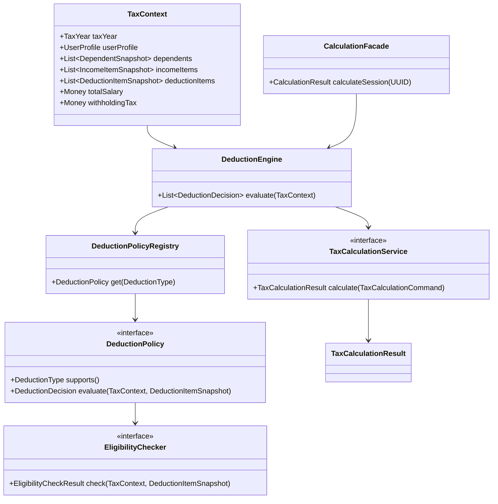

# 연말정산 공제 규칙 엔진 / 계산 엔진 설계

## 1. 왜 규칙과 계산을 분리해야 하는가
연말정산 시스템에서 가장 자주 바뀌는 것은 "어떤 항목이 공제 대상인가"와 "얼마까지 인정되는가"이다. 반면 세액 계산의 큰 흐름은 상대적으로 안정적이다. 이 둘을 한 서비스에 섞으면 다음 문제가 생긴다.

- 공제 조건이 하나 추가될 때마다 세액 계산 코드까지 수정하게 된다.
- "왜 적용됐는지"와 "최종 세액이 왜 그렇게 나왔는지"를 설명하기 어려워진다.
- 테스트가 거대해져서 작은 규칙 변경도 회귀 범위를 넓힌다.
- `if-else`와 `switch`가 세법 연도별로 누적되면서 유지보수가 급격히 어려워진다.

실무적으로는 아래처럼 책임을 나누는 것이 가장 안정적이다.

- 규칙 엔진: 공제 가능 여부와 공제 인정 금액을 판단한다.
- 계산 엔진: 판단 결과를 모아 과세표준, 산출세액, 결정세액, 환급액을 계산한다.

즉 질문이 다르다.

- 규칙 엔진의 질문: "이 지출은 공제 대상인가?"
- 계산 엔진의 질문: "공제 대상 금액을 반영하면 최종 세액은 얼마인가?"

## 2. 핵심 역할 정의

### 2-1. DeductionPolicy의 역할
`DeductionPolicy`는 "특정 공제 항목"의 도메인 규칙을 캡슐화한다. 예를 들어 의료비 공제 정책, 교육비 공제 정책, 보험료 공제 정책은 각각 별도 정책 객체로 분리한다.

해야 할 일:

- 자신이 담당하는 공제 타입을 식별한다.
- 여러 `EligibilityChecker`를 조합해 공제 가능 여부를 판단한다.
- 공제 가능하다면 인정 금액, 한도 적용 금액, 설명 문구를 만든다.
- 공제 불가라면 미적용 사유를 만든다.

하지 말아야 할 일:

- DB 조회를 직접 하지 않는다.
- 전체 세액 계산을 하지 않는다.
- 다른 공제 항목의 로직을 침범하지 않는다.

### 2-2. EligibilityChecker의 역할
`EligibilityChecker`는 공제 가능 여부를 구성하는 "작은 조건" 한 개를 담당한다.

예를 들면:

- 부양가족 소득 요건 충족 여부
- 나이 요건 충족 여부
- 본인/배우자/부양가족 범위 여부
- 최소 사용 금액 초과 여부
- 증빙서류 제출 여부

핵심은 조건을 잘게 쪼개는 것이다. 그래야 정책 객체가 거대해지지 않고, 여러 정책에서 재사용도 가능하다.

### 2-3. TaxCalculationService의 역할
`TaxCalculationService`는 규칙 엔진이 만든 공제 결과를 입력으로 받아 세금을 계산한다.

해야 할 일:

- 총급여, 소득금액, 과세표준 계산
- 공제 반영 후 산출세액 계산
- 세액공제/감면 반영
- 기납부세액과 비교해 환급액 또는 추가 납부세액 계산
- 계산 과정 추적 로그 생성

하지 말아야 할 일:

- "공제 가능 여부" 자체를 다시 판단하지 않는다.
- 특정 공제 항목의 세부 조건을 직접 알지 않는다.

## 3. 권장 아키텍처



## 4. 계층별 입력과 출력

| 계층 | 입력 | 출력 | 설명 |
| --- | --- | --- | --- |
| `CalculationFacade` | `sessionId` | `CalculationResult` | 세션 데이터를 읽어 전체 계산을 오케스트레이션 |
| `DeductionEngine` | `TaxContext` | `List<DeductionDecision>` | 입력된 공제 항목별 평가 결과 |
| `DeductionPolicy` | `TaxContext`, `DeductionItemSnapshot` | `DeductionDecision` | 공제 항목 하나에 대한 판정 결과 |
| `EligibilityChecker` | `TaxContext`, `DeductionItemSnapshot` | `EligibilityCheckResult` | 단일 조건 충족 여부 |
| `TaxCalculationService` | `TaxCalculationCommand` | `TaxCalculationResult` | 세액 계산 최종 결과 |

## 5. Spring Boot에서 바로 구현 가능한 패키지 구조

```text
com.example.yearend
  deduction
    application
      DeductionEngine.java
      DeductionPolicyRegistry.java
    domain
      DeductionPolicy.java
      AbstractDeductionPolicy.java
      EligibilityChecker.java
      DeductionDecision.java
      EligibilityCheckResult.java
      DeductionType.java
    infrastructure
      policy
        MedicalExpenseDeductionPolicy.java
        EducationDeductionPolicy.java
      checker
        BaseDependentChecker.java
        DependentIncomeChecker.java
        MedicalExpenseThresholdChecker.java
        EducationInstitutionChecker.java
  calculation
    application
      CalculationFacade.java
    domain
      TaxCalculationService.java
      DefaultTaxCalculationService.java
      TaxCalculationCommand.java
      TaxCalculationResult.java
      ProgressiveTaxTable.java
  taxsession
    application
      TaxContextAssembler.java
    domain
      TaxContext.java
      DeductionItemSnapshot.java
      IncomeItemSnapshot.java
      DependentSnapshot.java
  common
    domain
      Money.java
```

## 6. 핵심 도메인 모델

```java
package com.example.yearend.common.domain;

import java.math.BigDecimal;
import java.math.RoundingMode;

public record Money(BigDecimal amount) {

    public static Money of(long amount) {
        return new Money(BigDecimal.valueOf(amount));
    }

    public static Money zero() {
        return Money.of(0);
    }

    public Money add(Money other) {
        return new Money(this.amount.add(other.amount));
    }

    public Money subtract(Money other) {
        return new Money(this.amount.subtract(other.amount));
    }

    public Money multiply(BigDecimal rate) {
        return new Money(this.amount.multiply(rate).setScale(0, RoundingMode.DOWN));
    }

    public Money max(Money other) {
        return this.amount.compareTo(other.amount) >= 0 ? this : other;
    }

    public Money min(Money other) {
        return this.amount.compareTo(other.amount) <= 0 ? this : other;
    }

    public boolean isLessThan(Money other) {
        return this.amount.compareTo(other.amount) < 0;
    }

    public boolean isGreaterThanOrEqual(Money other) {
        return this.amount.compareTo(other.amount) >= 0;
    }
}
```

```java
package com.example.yearend.deduction.domain;

public enum DeductionType {
    MEDICAL_EXPENSE,
    EDUCATION_EXPENSE
}
```

```java
package com.example.yearend.taxsession.domain;

import com.example.yearend.common.domain.Money;
import com.example.yearend.deduction.domain.DeductionType;

import java.util.List;
import java.util.UUID;

public record TaxContext(
    int taxYear,
    UUID userId,
    Money totalSalary,
    Money withholdingTax,
    List<DependentSnapshot> dependents,
    List<IncomeItemSnapshot> incomeItems,
    List<DeductionItemSnapshot> deductionItems
) {
}

public record DeductionItemSnapshot(
    UUID itemId,
    DeductionType deductionType,
    UUID dependentId,
    Money amount,
    String metadata
) {
}
```

## 7. 인터페이스 설계

### 7-1. DeductionPolicy

```java
package com.example.yearend.deduction.domain;

import com.example.yearend.taxsession.domain.DeductionItemSnapshot;
import com.example.yearend.taxsession.domain.TaxContext;

public interface DeductionPolicy {

    DeductionType supports();

    DeductionDecision evaluate(TaxContext context, DeductionItemSnapshot item);
}
```

### 7-2. EligibilityChecker

```java
package com.example.yearend.deduction.domain;

import com.example.yearend.taxsession.domain.DeductionItemSnapshot;
import com.example.yearend.taxsession.domain.TaxContext;

public interface EligibilityChecker {

    EligibilityCheckResult check(TaxContext context, DeductionItemSnapshot item);
}
```

### 7-3. TaxCalculationService

```java
package com.example.yearend.calculation.domain;

public interface TaxCalculationService {

    TaxCalculationResult calculate(TaxCalculationCommand command);
}
```

## 8. 공통 결과 모델

```java
package com.example.yearend.deduction.domain;

import com.example.yearend.common.domain.Money;

import java.util.List;
import java.util.UUID;

public record DeductionDecision(
    UUID itemId,
    DeductionType deductionType,
    boolean eligible,
    Money requestedAmount,
    Money eligibleAmount,
    Money appliedAmount,
    List<String> reasons
) {
    public static DeductionDecision rejected(UUID itemId, DeductionType deductionType, Money requestedAmount, List<String> reasons) {
        return new DeductionDecision(itemId, deductionType, false, requestedAmount, Money.zero(), Money.zero(), reasons);
    }
}

public record EligibilityCheckResult(
    boolean passed,
    String reason
) {
    public static EligibilityCheckResult pass(String reason) {
        return new EligibilityCheckResult(true, reason);
    }

    public static EligibilityCheckResult fail(String reason) {
        return new EligibilityCheckResult(false, reason);
    }
}
```

## 9. 정책 패턴 / 전략 패턴 적용 방식

이 설계의 핵심은 "정책은 교체 가능해야 하고, 조건은 조합 가능해야 한다"는 점이다.

- `DeductionPolicy`: 공제 항목별 정책 객체다. 정책 패턴 적용.
- `EligibilityChecker`: 개별 조건 전략이다. 전략 패턴 적용.
- `AbstractDeductionPolicy`: 공통 평가 흐름을 재사용하는 템플릿 메서드다.

즉 구조는 아래처럼 이해하면 된다.

- 큰 전략: "의료비 공제 규칙", "교육비 공제 규칙"
- 작은 전략: "부양가족 소득 요건", "최소 사용 금액 초과 요건", "학교 유형 요건"
- 공통 알고리즘: "체커를 순회 -> 실패 사유 수집 -> 금액 계산 -> 한도 적용 -> 결과 반환"

## 10. 구현 예시: AbstractDeductionPolicy

```java
package com.example.yearend.deduction.domain;

import com.example.yearend.common.domain.Money;
import com.example.yearend.taxsession.domain.DeductionItemSnapshot;
import com.example.yearend.taxsession.domain.TaxContext;

import java.util.ArrayList;
import java.util.List;

public abstract class AbstractDeductionPolicy implements DeductionPolicy {

    private final List<EligibilityChecker> checkers;

    protected AbstractDeductionPolicy(List<EligibilityChecker> checkers) {
        this.checkers = checkers;
    }

    @Override
    public DeductionDecision evaluate(TaxContext context, DeductionItemSnapshot item) {
        List<String> reasons = new ArrayList<>();

        for (EligibilityChecker checker : checkers) {
            EligibilityCheckResult result = checker.check(context, item);
            reasons.add(result.reason());
            if (!result.passed()) {
                return DeductionDecision.rejected(item.itemId(), supports(), item.amount(), reasons);
            }
        }

        Money eligibleAmount = calculateEligibleAmount(context, item);
        Money appliedAmount = applyLimit(context, item, eligibleAmount);
        reasons.add(explainApplied(context, item, eligibleAmount, appliedAmount));

        return new DeductionDecision(
            item.itemId(),
            supports(),
            true,
            item.amount(),
            eligibleAmount,
            appliedAmount,
            reasons
        );
    }

    protected abstract Money calculateEligibleAmount(TaxContext context, DeductionItemSnapshot item);

    protected Money applyLimit(TaxContext context, DeductionItemSnapshot item, Money eligibleAmount) {
        return eligibleAmount;
    }

    protected abstract String explainApplied(TaxContext context, DeductionItemSnapshot item, Money eligibleAmount, Money appliedAmount);
}
```

이 구조를 쓰면 각 정책은 "자신만의 계산 공식"과 "설명 문구"에 집중할 수 있다. 조건 판정 루프는 공통으로 재사용하므로 중복이 줄고 테스트도 쉬워진다.

## 11. 샘플 공제 항목 1: 의료비 공제

예시 규칙:

- 총급여의 3%를 초과한 의료비만 인정
- 본인/배우자/부양가족 범위만 인정
- 설명용 reason을 함께 남김

### 11-1. 체커 구현

```java
package com.example.yearend.deduction.infrastructure.checker;

import com.example.yearend.deduction.domain.EligibilityCheckResult;
import com.example.yearend.deduction.domain.EligibilityChecker;
import com.example.yearend.taxsession.domain.DeductionItemSnapshot;
import com.example.yearend.taxsession.domain.TaxContext;
import org.springframework.stereotype.Component;

@Component
public class MedicalExpenseThresholdChecker implements EligibilityChecker {

    @Override
    public EligibilityCheckResult check(TaxContext context, DeductionItemSnapshot item) {
        var threshold = context.totalSalary().multiply(new java.math.BigDecimal("0.03"));
        if (item.amount().isLessThan(threshold)) {
            return EligibilityCheckResult.fail("의료비 사용액이 총급여의 3% 기준에 미달합니다.");
        }
        return EligibilityCheckResult.pass("총급여 3% 초과 요건을 충족합니다.");
    }
}
```

### 11-2. 정책 구현

```java
package com.example.yearend.deduction.infrastructure.policy;

import com.example.yearend.common.domain.Money;
import com.example.yearend.deduction.domain.AbstractDeductionPolicy;
import com.example.yearend.deduction.domain.DeductionType;
import com.example.yearend.deduction.domain.EligibilityChecker;
import com.example.yearend.taxsession.domain.DeductionItemSnapshot;
import com.example.yearend.taxsession.domain.TaxContext;
import org.springframework.stereotype.Component;

import java.math.BigDecimal;
import java.util.List;

@Component
public class MedicalExpenseDeductionPolicy extends AbstractDeductionPolicy {

    public MedicalExpenseDeductionPolicy(List<EligibilityChecker> medicalExpenseCheckers) {
        super(medicalExpenseCheckers);
    }

    @Override
    public DeductionType supports() {
        return DeductionType.MEDICAL_EXPENSE;
    }

    @Override
    protected Money calculateEligibleAmount(TaxContext context, DeductionItemSnapshot item) {
        Money threshold = context.totalSalary().multiply(new BigDecimal("0.03"));
        return item.amount().subtract(threshold).max(Money.zero());
    }

    @Override
    protected String explainApplied(TaxContext context, DeductionItemSnapshot item, Money eligibleAmount, Money appliedAmount) {
        return "의료비 공제 인정 금액을 계산했습니다.";
    }
}
```

실제 프로젝트에서는 `medicalExpenseCheckers`를 아무 체커나 다 넣지 말고 `@Qualifier` 또는 별도 조합 클래스로 묶는 편이 안전하다. 예시는 이해를 돕기 위한 단순화 버전이다.

## 12. 샘플 공제 항목 2: 교육비 공제

예시 규칙:

- 본인 또는 공제 대상 부양가족만 가능
- 학교 유형에 따라 한도 다름
- 대학교는 예시로 연 900만원 한도 적용

### 12-1. 체커 구현

```java
package com.example.yearend.deduction.infrastructure.checker;

import com.example.yearend.deduction.domain.EligibilityCheckResult;
import com.example.yearend.deduction.domain.EligibilityChecker;
import com.example.yearend.taxsession.domain.DeductionItemSnapshot;
import com.example.yearend.taxsession.domain.TaxContext;
import org.springframework.stereotype.Component;

@Component
public class EducationInstitutionChecker implements EligibilityChecker {

    @Override
    public EligibilityCheckResult check(TaxContext context, DeductionItemSnapshot item) {
        if (item.metadata() == null || item.metadata().isBlank()) {
            return EligibilityCheckResult.fail("교육기관 정보가 없습니다.");
        }
        return EligibilityCheckResult.pass("교육기관 정보가 확인되었습니다.");
    }
}
```

### 12-2. 정책 구현

```java
package com.example.yearend.deduction.infrastructure.policy;

import com.example.yearend.common.domain.Money;
import com.example.yearend.deduction.domain.AbstractDeductionPolicy;
import com.example.yearend.deduction.domain.DeductionType;
import com.example.yearend.deduction.domain.EligibilityChecker;
import com.example.yearend.taxsession.domain.DeductionItemSnapshot;
import com.example.yearend.taxsession.domain.TaxContext;
import org.springframework.stereotype.Component;

import java.util.List;

@Component
public class EducationDeductionPolicy extends AbstractDeductionPolicy {

    private static final Money UNIVERSITY_LIMIT = Money.of(9_000_000);

    public EducationDeductionPolicy(List<EligibilityChecker> educationCheckers) {
        super(educationCheckers);
    }

    @Override
    public DeductionType supports() {
        return DeductionType.EDUCATION_EXPENSE;
    }

    @Override
    protected Money calculateEligibleAmount(TaxContext context, DeductionItemSnapshot item) {
        return item.amount();
    }

    @Override
    protected Money applyLimit(TaxContext context, DeductionItemSnapshot item, Money eligibleAmount) {
        return eligibleAmount.min(UNIVERSITY_LIMIT);
    }

    @Override
    protected String explainApplied(TaxContext context, DeductionItemSnapshot item, Money eligibleAmount, Money appliedAmount) {
        return "교육비 공제 한도를 적용했습니다.";
    }
}
```

## 13. DeductionEngine과 PolicyRegistry

`if-else` 지옥을 피하려면 "타입별 정책 선택"을 분리해야 한다.

```java
package com.example.yearend.deduction.application;

import com.example.yearend.deduction.domain.DeductionDecision;
import com.example.yearend.deduction.domain.DeductionPolicy;
import com.example.yearend.deduction.domain.DeductionType;
import org.springframework.stereotype.Component;

import java.util.EnumMap;
import java.util.List;
import java.util.Map;

@Component
public class DeductionPolicyRegistry {

    private final Map<DeductionType, DeductionPolicy> policies;

    public DeductionPolicyRegistry(List<DeductionPolicy> policies) {
        this.policies = new EnumMap<>(DeductionType.class);
        for (DeductionPolicy policy : policies) {
            this.policies.put(policy.supports(), policy);
        }
    }

    public DeductionPolicy get(DeductionType type) {
        var policy = policies.get(type);
        if (policy == null) {
            throw new IllegalArgumentException("지원하지 않는 공제 타입입니다. type=" + type);
        }
        return policy;
    }
}
```

```java
package com.example.yearend.deduction.application;

import com.example.yearend.deduction.domain.DeductionDecision;
import com.example.yearend.taxsession.domain.TaxContext;
import org.springframework.stereotype.Component;

import java.util.List;

@Component
public class DeductionEngine {

    private final DeductionPolicyRegistry registry;

    public DeductionEngine(DeductionPolicyRegistry registry) {
        this.registry = registry;
    }

    public List<DeductionDecision> evaluate(TaxContext context) {
        return context.deductionItems().stream()
            .map(item -> registry.get(item.deductionType()).evaluate(context, item))
            .toList();
    }
}
```

이 구조의 장점:

- 정책 추가 시 기존 `switch`를 열지 않는다.
- 스프링이 정책 구현체를 자동 주입해준다.
- 정책 선택 책임이 `Registry` 하나로 모인다.

## 14. TaxCalculationService 설계

규칙 엔진이 만든 결과를 계산 엔진이 받는 구조다.

```java
package com.example.yearend.calculation.domain;

import com.example.yearend.common.domain.Money;
import com.example.yearend.deduction.domain.DeductionDecision;

import java.util.List;

public record TaxCalculationCommand(
    Money totalSalary,
    Money withholdingTax,
    List<DeductionDecision> deductionDecisions
) {
}

public record TaxCalculationResult(
    Money totalDeductionAmount,
    Money taxableIncome,
    Money calculatedTax,
    Money finalTax,
    Money expectedRefund,
    List<String> trace
) {
}
```

```java
package com.example.yearend.calculation.domain;

import com.example.yearend.common.domain.Money;
import com.example.yearend.deduction.domain.DeductionDecision;
import org.springframework.stereotype.Service;

import java.math.BigDecimal;
import java.util.ArrayList;
import java.util.List;

@Service
public class DefaultTaxCalculationService implements TaxCalculationService {

    @Override
    public TaxCalculationResult calculate(TaxCalculationCommand command) {
        List<String> trace = new ArrayList<>();

        Money totalDeduction = command.deductionDecisions().stream()
            .filter(DeductionDecision::eligible)
            .map(DeductionDecision::appliedAmount)
            .reduce(Money.zero(), Money::add);

        trace.add("총 공제 반영 금액 = " + totalDeduction.amount());

        Money taxableIncome = command.totalSalary().subtract(totalDeduction).max(Money.zero());
        trace.add("과세표준 = 총급여 - 총공제 = " + taxableIncome.amount());

        Money calculatedTax = progressiveTax(taxableIncome);
        trace.add("누진세율 적용 산출세액 = " + calculatedTax.amount());

        Money finalTax = calculatedTax;
        Money expectedRefund = command.withholdingTax().subtract(finalTax);
        trace.add("예상 환급액 = 기납부세액 - 결정세액 = " + expectedRefund.amount());

        return new TaxCalculationResult(
            totalDeduction,
            taxableIncome,
            calculatedTax,
            finalTax,
            expectedRefund,
            trace
        );
    }

    private Money progressiveTax(Money taxableIncome) {
        if (taxableIncome.amount().compareTo(BigDecimal.valueOf(14_000_000)) <= 0) {
            return taxableIncome.multiply(new BigDecimal("0.06"));
        }
        return taxableIncome.multiply(new BigDecimal("0.15"));
    }
}
```

실무에서는 누진세율, 근로소득공제, 세액공제, 특별세액공제를 각각 별도 컴포넌트로 더 세분화해도 좋다. 중요한 것은 `TaxCalculationService`가 공제 조건을 다시 해석하지 않는다는 점이다.

## 15. CalculationFacade 예시

```java
package com.example.yearend.calculation.application;

import com.example.yearend.calculation.domain.TaxCalculationCommand;
import com.example.yearend.calculation.domain.TaxCalculationResult;
import com.example.yearend.calculation.domain.TaxCalculationService;
import com.example.yearend.deduction.application.DeductionEngine;
import com.example.yearend.taxsession.application.TaxContextAssembler;
import org.springframework.stereotype.Service;
import org.springframework.transaction.annotation.Transactional;

import java.util.UUID;

@Service
public class CalculationFacade {

    private final TaxContextAssembler taxContextAssembler;
    private final DeductionEngine deductionEngine;
    private final TaxCalculationService taxCalculationService;

    public CalculationFacade(
        TaxContextAssembler taxContextAssembler,
        DeductionEngine deductionEngine,
        TaxCalculationService taxCalculationService
    ) {
        this.taxContextAssembler = taxContextAssembler;
        this.deductionEngine = deductionEngine;
        this.taxCalculationService = taxCalculationService;
    }

    @Transactional
    public TaxCalculationResult calculateSession(UUID sessionId) {
        var context = taxContextAssembler.assemble(sessionId);
        var decisions = deductionEngine.evaluate(context);

        return taxCalculationService.calculate(
            new TaxCalculationCommand(
                context.totalSalary(),
                context.withholdingTax(),
                decisions
            )
        );
    }
}
```

이 `Facade`는 애플리케이션 서비스다. DB 조회, 트랜잭션, 저장 같은 오케스트레이션을 담당하고, 정책과 계산 로직은 도메인 서비스에 위임한다.

## 16. 새로운 공제 항목이 추가될 때 확장 방식

예를 들어 "기부금 공제"가 추가된다고 가정하면 아래 순서로 확장한다.

1. `DeductionType`에 `DONATION` 추가
2. `DonationDeductionPolicy` 구현
3. 필요한 `EligibilityChecker` 구현 또는 재사용
4. 입력 DTO, 엔티티, Swagger 스펙에 항목 추가
5. 단위 테스트 추가

기존 `MedicalExpenseDeductionPolicy`, `EducationDeductionPolicy`, `TaxCalculationService`는 수정하지 않는 것이 이상적이다.

즉 확장의 기준은 "기존 코드를 뜯어고치는 것"이 아니라 "새 정책 클래스를 추가하는 것"이어야 한다. 이것이 객체지향 확장에 가까운 구조다.

## 17. if-else 지옥을 피하는 구조

### 17-1. 잘못 설계한 예시

```java
public Money calculateDeduction(TaxContext context, DeductionItemSnapshot item) {
    if (item.deductionType() == DeductionType.MEDICAL_EXPENSE) {
        if (item.amount().isLessThan(context.totalSalary().multiply(new BigDecimal("0.03")))) {
            return Money.zero();
        }
        return item.amount().subtract(context.totalSalary().multiply(new BigDecimal("0.03")));
    } else if (item.deductionType() == DeductionType.EDUCATION_EXPENSE) {
        if (item.metadata() == null) {
            return Money.zero();
        }
        return item.amount().min(Money.of(9_000_000));
    } else if (...) {
        ...
    }
}
```

문제점:

- 공제 항목이 늘어날수록 메서드가 비대해진다.
- 적용 사유와 미적용 사유를 구조적으로 남기기 어렵다.
- 정책별 테스트가 아니라 거대한 통합 테스트만 남게 된다.

### 17-2. 개선된 예시

```java
public DeductionDecision evaluate(TaxContext context, DeductionItemSnapshot item) {
    DeductionPolicy policy = registry.get(item.deductionType());
    return policy.evaluate(context, item);
}
```

장점:

- 타입 선택은 `Registry`
- 조건 판단은 `Checker`
- 금액 계산은 `Policy`
- 최종 세금 계산은 `TaxCalculationService`

책임이 분리되니 각 테스트가 짧고 선명해진다.

## 18. 테스트하기 쉬운 구조로 만드는 방법

핵심 원칙은 "도메인 로직은 순수 함수처럼 만든다"이다.

### 18-1. 정책은 DB를 직접 조회하지 않는다
정책 내부에서 JPA Repository를 호출하면 테스트가 무거워진다. 세션 데이터를 미리 `TaxContext`로 조립해서 정책에 넣어야 한다.

### 18-2. Checker는 한 조건만 검사한다
체커 하나당 테스트 하나로 끝낼 수 있어야 한다.

예시:

- `MedicalExpenseThresholdCheckerTest`
- `EducationInstitutionCheckerTest`
- `DependentIncomeCheckerTest`

### 18-3. Policy는 조합 테스트로 검증한다

- 성공 케이스
- 체커 실패 케이스
- 한도 적용 케이스
- 설명 문구 생성 케이스

### 18-4. TaxCalculationService는 계산표 기반 테스트로 검증한다

- 총급여 5,000만원 / 공제 300만원 / 기납부세액 200만원
- 총급여 8,000만원 / 공제 700만원 / 기납부세액 500만원

이런 식으로 엑셀처럼 표를 만들어 기대값을 넣으면 된다.

### 18-5. 추천 테스트 레이어

- 단위 테스트: `EligibilityChecker`, `DeductionPolicy`, `TaxCalculationService`
- 통합 테스트: `CalculationFacade`, API
- 저장소 테스트: JPA 슬라이스 테스트

## 19. 면접에서 강조할 포인트

### 19-1. 설계 의도
- "세법 규칙은 자주 바뀌고, 세액 계산 흐름은 상대적으로 안정적이어서 분리했습니다."
- "공제 규칙은 정책 객체로 분리하고, 작은 조건은 체커로 쪼개 설명 가능성을 높였습니다."

### 19-2. 객체지향 포인트
- "새 공제 항목이 추가될 때 기존 `if-else`를 수정하지 않고 정책 클래스를 추가하는 구조입니다."
- "정책 선택은 Registry, 조건 조합은 Checker, 최종 세액 계산은 CalculationService가 담당합니다."

### 19-3. 실무 포인트
- "결과값만 반환하지 않고 적용 사유와 미적용 사유를 남겨 운영자와 사용자 모두가 결과를 이해할 수 있게 했습니다."
- "도메인 로직을 `TaxContext` 기반 순수 계산 구조로 만들어 단위 테스트를 빠르게 돌릴 수 있게 했습니다."

## 20. 1년차 개발자 관점 정리

### 20-1. 이번 작업에서 새로 배우게 되는 개념
- 정책 패턴과 전략 패턴
- 템플릿 메서드 패턴
- 애플리케이션 서비스와 도메인 서비스의 역할 분리
- 설명 가능한 시스템 설계
- 순수 도메인 로직 테스트 방식

### 20-2. 왜 이런 구조를 쓰는지
- 규칙 변경이 잦은 영역을 객체로 분리해 수정 범위를 줄이기 위해서다.
- 계산과 판정을 분리해야 코드가 읽히고 테스트도 쉬워진다.
- 운영자가 결과를 추적해야 하는 업무 도메인에서는 reason 로그가 중요하기 때문이다.

### 20-3. 실무에서 자주 쓰는 이유
- 보험, 세무, 정산, 쿠폰, 결제 할인처럼 규칙이 자주 바뀌는 도메인에 매우 잘 맞는다.
- 기능 추가가 잦아도 기존 코드를 덜 건드리게 해준다.
- 테스트와 장애 분석 비용을 줄여준다.

### 20-4. 놓치기 쉬운 포인트
- `double` 대신 `BigDecimal` 또는 금액 전용 `Money` 객체를 써야 한다.
- 정책 클래스 안에서 DB 조회를 시작하면 테스트가 급격히 어려워진다.
- `reason`를 문자열 하나로 끝내지 말고 필요하면 코드값도 같이 남겨야 한다.
- `TaxCalculationService`에서 공제 조건을 다시 판단하면 책임이 섞인다.
- 스프링 `List<EligibilityChecker>` 주입 시 어떤 체커가 어느 정책용인지 구분 전략이 필요하다.

### 20-5. 더 공부할 키워드
- Strategy Pattern
- Policy Object Pattern
- Template Method Pattern
- Domain Service vs Application Service
- Specification Pattern
