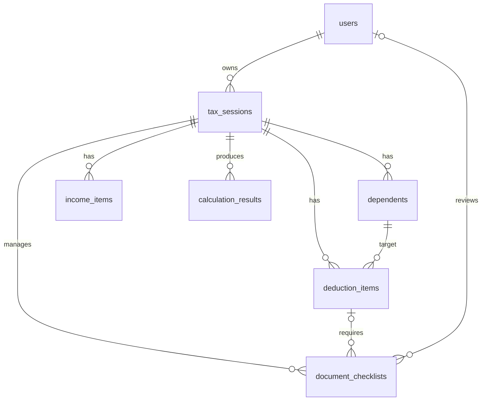

# 연말정산 공제 시뮬레이터 PostgreSQL ERD 초안

## 1. 설계 전제

이 문서는 아래 8개 테이블 기준의 1차 ERD 초안이다.

- `users`
- `tax_sessions`
- `dependents`
- `income_items`
- `deduction_items`
- `deduction_rules`
- `calculation_results`
- `document_checklists`

기본 원칙은 다음과 같다.

- PK는 전부 `uuid`
- 금액은 원 단위 정수로 저장하므로 `bigint`
- 시간은 `timestamptz`
- 세션 기반 스냅샷 구조
- 계산 결과는 append-only 이력 저장
- 민감한 주민번호 원문 저장 금지

## 2. ERD 관계 요약

## 3. 공통 규칙

### 3-1. 공통 컬럼 규칙

| 항목 | 권장안 |
| --- | --- |
| PK | `id uuid` |
| 생성 시각 | `created_at timestamptz not null` |
| 수정 시각 | `updated_at timestamptz not null` |
| Soft delete | 필요한 경우 `deleted_at timestamptz null` |
| 금액 | `bigint not null default 0` |
| 가변 속성 | 꼭 필요한 경우만 `jsonb` |

### 3-2. Soft delete 기준

- `users`, `tax_sessions`, `dependents`, `income_items`, `deduction_items`
  - 추천
  - 이유: 사용자가 수정/삭제한 데이터도 감사와 복구 관점에서 남겨둘 가치가 큼
- `deduction_rules`
  - 비추천
  - 이유: 삭제 대신 `is_active`, `effective_from`, `effective_to`, `rule_version`으로 관리
- `calculation_results`
  - 비추천
  - 이유: 계산 이력은 보존 대상이며 append-only 성격이 강함
- `document_checklists`
  - 1차는 비추천
  - 이유: 현재 상태 테이블로 쓰고, 상세 변경 이력은 별도 이력 테이블로 분리하는 편이 명확함

## 4. 테이블 상세 설계

## 4-1. `users`

### 테이블 목적
인증과 권한 관리를 위한 사용자 마스터 테이블이다. 일반 사용자와 관리자 계정을 함께 관리한다.

### 컬럼 설계

| 컬럼명 | 타입 | Null 허용 | PK/FK | 인덱스 | 설명 |
| --- | --- | --- | --- | --- | --- |
| `id` | `uuid` | N | PK | PK 자동 | 사용자 식별자 |
| `email` | `varchar(255)` | N | - | Unique Index 필요 | 로그인 ID |
| `password_hash` | `varchar(255)` | N | - | 불필요 | BCrypt/Argon2 해시값 |
| `name` | `varchar(100)` | N | - | 선택 | 사용자 이름 |
| `role` | `varchar(20)` | N | - | Index 선택 | `USER`, `ADMIN` |
| `status` | `varchar(20)` | N | - | Index 선택 | `ACTIVE`, `INACTIVE`, `LOCKED` |
| `last_login_at` | `timestamptz` | Y | - | 불필요 | 마지막 로그인 시각 |
| `created_at` | `timestamptz` | N | - | 불필요 | 생성 시각 |
| `updated_at` | `timestamptz` | N | - | 불필요 | 수정 시각 |
| `deleted_at` | `timestamptz` | Y | - | Index 선택 | Soft delete 시각 |

### 메모
- `created_at`, `updated_at` 포함: 예
- Soft delete 필요: 예

## 4-2. `tax_sessions`

### 테이블 목적
연말정산 입력과 계산의 기준 단위다. 한 사용자가 특정 과세연도에 작성한 세션을 나타낸다.

### 컬럼 설계

| 컬럼명 | 타입 | Null 허용 | PK/FK | 인덱스 | 설명 |
| --- | --- | --- | --- | --- | --- |
| `id` | `uuid` | N | PK | PK 자동 | 세션 식별자 |
| `user_id` | `uuid` | N | FK -> `users.id` | Index 필요 | 세션 소유 사용자 |
| `tax_year` | `integer` | N | - | Index 필요 | 과세연도 |
| `session_status` | `varchar(30)` | N | - | Index 필요 | `DRAFT`, `CALCULATED`, `SUBMITTED`, `REVIEWED` |
| `filing_type` | `varchar(30)` | N | - | 불필요 | `SALARY_WORKER` 등 |
| `rule_version` | `varchar(50)` | N | - | Index 선택 | 현재 세션 계산 기준 규칙 버전 |
| `basic_info_jsonb` | `jsonb` | N | - | GIN Index 선택 | 세대주 여부, 배우자 여부 등 세션 스냅샷 |
| `memo` | `text` | Y | - | 불필요 | 사용자 메모 |
| `submitted_at` | `timestamptz` | Y | - | 불필요 | 제출 시각 |
| `created_at` | `timestamptz` | N | - | 불필요 | 생성 시각 |
| `updated_at` | `timestamptz` | N | - | 불필요 | 수정 시각 |
| `deleted_at` | `timestamptz` | Y | - | Index 선택 | Soft delete 시각 |

### 추천 제약/인덱스
- Unique Index: `uk_tax_sessions_user_year (user_id, tax_year)`  
  단, 사용자당 연도별 세션을 하나만 허용할 경우에 적용
- 일반 Index: `(user_id, tax_year desc)`
- 일반 Index: `(session_status, tax_year)`

### 메모
- `created_at`, `updated_at` 포함: 예
- Soft delete 필요: 예

## 4-3. `dependents`

### 테이블 목적
세션에 속한 부양가족 정보를 저장한다. 부양가족 판단은 연말정산 연도 기준 스냅샷이어야 하므로 사용자 프로필과 분리한다.

### 컬럼 설계

| 컬럼명 | 타입 | Null 허용 | PK/FK | 인덱스 | 설명 |
| --- | --- | --- | --- | --- | --- |
| `id` | `uuid` | N | PK | PK 자동 | 부양가족 식별자 |
| `tax_session_id` | `uuid` | N | FK -> `tax_sessions.id` | Index 필요 | 소속 세션 |
| `name` | `varchar(100)` | N | - | 불필요 | 이름 |
| `relation_type` | `varchar(30)` | N | - | Index 선택 | `SPOUSE`, `CHILD`, `PARENT` |
| `birth_date` | `date` | N | - | 불필요 | 나이 판정 기준 |
| `annual_income_amount` | `bigint` | N | - | Index 선택 | 연간 소득 금액 |
| `resident_type` | `varchar(20)` | N | - | 불필요 | 거주자 여부 등 |
| `lives_together` | `boolean` | N | - | 불필요 | 동거 여부 |
| `is_disabled` | `boolean` | N | - | Index 선택 | 장애인 여부 |
| `is_basic_deduction_target` | `boolean` | N | - | Index 선택 | 기본공제 대상 여부 스냅샷 |
| `attributes_jsonb` | `jsonb` | N | - | GIN Index 선택 | 추가 속성 |
| `created_at` | `timestamptz` | N | - | 불필요 | 생성 시각 |
| `updated_at` | `timestamptz` | N | - | 불필요 | 수정 시각 |
| `deleted_at` | `timestamptz` | Y | - | Index 선택 | Soft delete 시각 |

### 추천 제약/인덱스
- 일반 Index: `(tax_session_id, relation_type)`
- 일반 Index: `(tax_session_id, is_basic_deduction_target)`

### 메모
- `created_at`, `updated_at` 포함: 예
- Soft delete 필요: 예

## 4-4. `income_items`

### 테이블 목적
세션의 소득 항목을 저장한다. 총급여, 기타소득, 기납부세액 계산의 기초 데이터다.

### 컬럼 설계

| 컬럼명 | 타입 | Null 허용 | PK/FK | 인덱스 | 설명 |
| --- | --- | --- | --- | --- | --- |
| `id` | `uuid` | N | PK | PK 자동 | 소득 항목 식별자 |
| `tax_session_id` | `uuid` | N | FK -> `tax_sessions.id` | Index 필요 | 소속 세션 |
| `income_type` | `varchar(30)` | N | - | Index 필요 | `SALARY`, `BONUS`, `OTHER_INCOME` |
| `payer_name` | `varchar(200)` | Y | - | 선택 | 지급처 |
| `gross_amount` | `bigint` | N | - | 불필요 | 총금액 |
| `taxable_amount` | `bigint` | N | - | 불필요 | 과세 대상 금액 |
| `withheld_tax_amount` | `bigint` | N | - | 불필요 | 원천징수 세액 |
| `non_taxable_amount` | `bigint` | N | - | 불필요 | 비과세 금액 |
| `attributes_jsonb` | `jsonb` | N | - | GIN Index 선택 | 원천징수영수증 상세 등 |
| `created_at` | `timestamptz` | N | - | 불필요 | 생성 시각 |
| `updated_at` | `timestamptz` | N | - | 불필요 | 수정 시각 |
| `deleted_at` | `timestamptz` | Y | - | Index 선택 | Soft delete 시각 |

### 추천 제약/인덱스
- 일반 Index: `(tax_session_id, income_type)`

### 메모
- `created_at`, `updated_at` 포함: 예
- Soft delete 필요: 예

## 4-5. `deduction_items`

### 테이블 목적
세션의 공제 대상 지출 입력값을 저장한다. 의료비, 교육비, 기부금 등 사용자가 입력한 공제 항목의 원본 데이터다.

### 컬럼 설계

| 컬럼명 | 타입 | Null 허용 | PK/FK | 인덱스 | 설명 |
| --- | --- | --- | --- | --- | --- |
| `id` | `uuid` | N | PK | PK 자동 | 공제 항목 식별자 |
| `tax_session_id` | `uuid` | N | FK -> `tax_sessions.id` | Index 필요 | 소속 세션 |
| `dependent_id` | `uuid` | Y | FK -> `dependents.id` | Index 필요 | 관련 부양가족, 본인이면 null 가능 |
| `deduction_type` | `varchar(50)` | N | - | Index 필요 | `MEDICAL_EXPENSE`, `EDUCATION_EXPENSE` |
| `sub_type` | `varchar(50)` | Y | - | Index 선택 | 세부 분류 |
| `amount` | `bigint` | N | - | 불필요 | 사용 금액 |
| `used_at` | `date` | Y | - | Index 선택 | 사용 일자 |
| `source_name` | `varchar(200)` | Y | - | 불필요 | 병원명, 학교명 등 |
| `evidence_status` | `varchar(20)` | N | - | Index 선택 | `PENDING`, `SUBMITTED`, `CONFIRMED` |
| `attributes_jsonb` | `jsonb` | N | - | GIN Index 선택 | 카드/현금영수증 여부, 학교유형 등 |
| `created_at` | `timestamptz` | N | - | 불필요 | 생성 시각 |
| `updated_at` | `timestamptz` | N | - | 불필요 | 수정 시각 |
| `deleted_at` | `timestamptz` | Y | - | Index 선택 | Soft delete 시각 |

### 추천 제약/인덱스
- 일반 Index: `(tax_session_id, deduction_type)`
- 일반 Index: `(dependent_id)`
- 일반 Index: `(tax_session_id, evidence_status)`

### 메모
- `created_at`, `updated_at` 포함: 예
- Soft delete 필요: 예

## 4-6. `deduction_rules`

### 테이블 목적
연도별 공제 규칙의 메타데이터를 저장한다. 계산식 전체를 DB로 빼는 것이 아니라, 버전과 설명, 한도, 활성 여부 같은 운영 가능한 정보만 저장한다.

### 컬럼 설계

| 컬럼명 | 타입 | Null 허용 | PK/FK | 인덱스 | 설명 |
| --- | --- | --- | --- | --- | --- |
| `id` | `uuid` | N | PK | PK 자동 | 규칙 식별자 |
| `tax_year` | `integer` | N | - | Index 필요 | 적용 연도 |
| `deduction_type` | `varchar(50)` | N | - | Index 필요 | 공제 타입 |
| `rule_code` | `varchar(100)` | N | - | Index 필요 | 예: `MEDICAL_THRESHOLD_RATE` |
| `rule_name` | `varchar(200)` | N | - | 불필요 | 화면 표시용 이름 |
| `rule_version` | `integer` | N | - | Index 필요 | 규칙 버전 |
| `rule_category` | `varchar(30)` | N | - | Index 선택 | `ELIGIBILITY`, `LIMIT`, `RATE` |
| `parameter_jsonb` | `jsonb` | N | - | GIN Index 선택 | 한도, 세율, 기준값 |
| `description` | `text` | Y | - | 불필요 | 규칙 설명 |
| `effective_from` | `date` | N | - | Index 선택 | 적용 시작일 |
| `effective_to` | `date` | Y | - | Index 선택 | 적용 종료일 |
| `is_active` | `boolean` | N | - | Index 필요 | 활성 여부 |
| `created_at` | `timestamptz` | N | - | 불필요 | 생성 시각 |
| `updated_at` | `timestamptz` | N | - | 불필요 | 수정 시각 |

### 추천 제약/인덱스
- Unique Index: `uk_deduction_rules_year_code_version (tax_year, rule_code, rule_version)`
- 일반 Index: `(tax_year, deduction_type, is_active)`

### 메모
- `created_at`, `updated_at` 포함: 예
- Soft delete 필요: 아니오

## 4-7. `calculation_results`

### 테이블 목적
세션 계산 결과를 버전별로 저장하는 이력 테이블이다. 최신 결과만 유지하지 않고 재계산 이력을 모두 남긴다.

### 컬럼 설계

| 컬럼명 | 타입 | Null 허용 | PK/FK | 인덱스 | 설명 |
| --- | --- | --- | --- | --- | --- |
| `id` | `uuid` | N | PK | PK 자동 | 계산 결과 식별자 |
| `tax_session_id` | `uuid` | N | FK -> `tax_sessions.id` | Index 필요 | 소속 세션 |
| `calculation_version` | `integer` | N | - | Index 필요 | 세션 내 계산 순번 |
| `rule_version` | `varchar(50)` | N | - | Index 선택 | 계산 당시 규칙 버전 |
| `input_hash` | `varchar(64)` | N | - | Index 선택 | 입력 스냅샷 해시 |
| `total_income_amount` | `bigint` | N | - | 불필요 | 총소득 |
| `total_deduction_amount` | `bigint` | N | - | 불필요 | 총공제 |
| `taxable_income_amount` | `bigint` | N | - | 불필요 | 과세표준 |
| `calculated_tax_amount` | `bigint` | N | - | 불필요 | 산출세액 |
| `tax_credit_amount` | `bigint` | N | - | 불필요 | 세액공제 |
| `final_tax_amount` | `bigint` | N | - | 불필요 | 결정세액 |
| `withholding_tax_amount` | `bigint` | N | - | 불필요 | 기납부세액 |
| `expected_refund_amount` | `bigint` | N | - | 불필요 | 예상 환급액 |
| `decision_trace_jsonb` | `jsonb` | N | - | GIN Index 선택 | 공제 판정/계산 상세 로그 |
| `summary_jsonb` | `jsonb` | N | - | GIN Index 선택 | 프론트 응답용 요약 |
| `created_at` | `timestamptz` | N | - | Index 선택 | 계산 시각 |

### 추천 제약/인덱스
- Unique Index: `uk_calculation_results_session_version (tax_session_id, calculation_version)`
- 일반 Index: `(tax_session_id, created_at desc)`

### 메모
- `created_at` 포함: 예
- `updated_at` 포함: 아니오  
  계산 이력은 append-only 성격이므로 수정 대신 새 row를 추가하는 방식을 권장
- Soft delete 필요: 아니오

## 4-8. `document_checklists`

### 테이블 목적
관리자가 세션별 제출 서류를 점검하기 위한 체크리스트 테이블이다. 누락 서류, 검토 상태, 코멘트를 관리한다.

### 컬럼 설계

| 컬럼명 | 타입 | Null 허용 | PK/FK | 인덱스 | 설명 |
| --- | --- | --- | --- | --- | --- |
| `id` | `uuid` | N | PK | PK 자동 | 체크리스트 식별자 |
| `tax_session_id` | `uuid` | N | FK -> `tax_sessions.id` | Index 필요 | 소속 세션 |
| `deduction_item_id` | `uuid` | Y | FK -> `deduction_items.id` | Index 선택 | 특정 공제 항목과 연결 가능 |
| `document_type` | `varchar(50)` | N | - | Index 필요 | `RECEIPT`, `CERTIFICATE`, `STATEMENT` |
| `required_yn` | `boolean` | N | - | Index 선택 | 제출 필요 여부 |
| `submitted_yn` | `boolean` | N | - | Index 선택 | 제출 완료 여부 |
| `review_status` | `varchar(20)` | N | - | Index 필요 | `PENDING`, `APPROVED`, `REJECTED` |
| `reviewed_by` | `uuid` | Y | FK -> `users.id` | Index 선택 | 검토 관리자 |
| `reviewed_at` | `timestamptz` | Y | - | 불필요 | 검토 시각 |
| `comment` | `text` | Y | - | 불필요 | 검토 의견 |
| `created_at` | `timestamptz` | N | - | 불필요 | 생성 시각 |
| `updated_at` | `timestamptz` | N | - | 불필요 | 수정 시각 |

### 추천 제약/인덱스
- 일반 Index: `(tax_session_id, review_status)`
- 일반 Index: `(reviewed_by, reviewed_at desc)`

### 메모
- `created_at`, `updated_at` 포함: 예
- Soft delete 필요: 아니오  
  상세 변경 이력은 별도 관리자 이력 테이블로 관리하는 편이 더 적절

## 5. 관계 설명

### 5-1. 사용자와 세션 관계
- `users 1 : N tax_sessions`
- 한 사용자는 여러 과세연도의 세션을 가질 수 있다.
- 1차 버전에서는 `user_id + tax_year`를 unique로 두어 연도별 세션 1개를 권장한다.
- 계산 결과 이력은 세션 안에서 별도로 관리하므로, 세션을 여러 개 만들기보다 결과 버전을 여러 개 두는 편이 깔끔하다.

### 5-2. 세션과 부양가족/소득/지출 관계
- `tax_sessions 1 : N dependents`
- `tax_sessions 1 : N income_items`
- `tax_sessions 1 : N deduction_items`
- `tax_sessions 1 : N calculation_results`
- `tax_sessions 1 : N document_checklists`

이 구조를 쓰는 이유는 세션이 "연말정산 계산 단위"이기 때문이다. 같은 사용자가 내년에 다시 입력하더라도, 작년 부양가족과 소득 구조는 달라질 수 있다. 그래서 사용자 프로필에 붙이지 않고 세션 스냅샷으로 관리한다.

## 6. 규칙 테이블을 어디까지 DB로 빼고 어디까지 코드로 둘지

### DB로 빼는 것
- 규칙 코드
- 적용 연도
- 규칙 버전
- 한도값, 비율값, 기준값
- 활성/비활성 여부
- 설명 문구
- 운영 화면에서 조회할 메타데이터

### 코드에 두는 것
- 복잡한 분기 로직
- 여러 조건의 조합 판정
- 부양가족 판정 알고리즘
- 공제 항목 간 상호작용
- 세액 계산 공식과 누진세율 흐름

### 권장 기준
규칙값은 DB, 규칙행동은 코드에 둔다.

예를 들어:
- "의료비 공제 기준율 3%"는 DB
- "총급여의 3%를 초과한 금액만 인정"이라는 계산 흐름은 코드

이렇게 해야 운영자는 연도별 기준값을 조회할 수 있고, 개발자는 복잡한 도메인 로직을 읽기 쉬운 객체로 유지할 수 있다.

## 7. 계산 결과 이력 저장 전략

### 권장안
- `calculation_results`는 append-only 테이블로 설계
- 계산할 때마다 새 row insert
- 기존 결과는 update 하지 않음
- 최신 결과 조회는 `tax_session_id` 기준 `created_at desc` 또는 `calculation_version desc`로 조회

### 왜 이렇게 하나
- "어떤 입력과 어떤 규칙 버전으로 계산했는지"를 나중에 재현할 수 있음
- 규칙 개정 전/후 결과 비교가 가능함
- 디버깅과 감사 대응이 쉬움

### 추천 컬럼
- `calculation_version`
- `rule_version`
- `input_hash`
- `decision_trace_jsonb`

이 네 개가 있으면 "같은 세션인데 왜 결과가 달라졌는지"를 설명하기 좋다.

## 8. 관리자 검토 이력 필요 여부

### 결론
실무적으로는 필요하다.

현재 8개 테이블만으로 시작한다면 `document_checklists`에는 "현재 상태"만 저장한다. 하지만 아래 정보는 별도 이력 테이블이 있으면 훨씬 좋다.

- 누가 검토했는지
- 언제 상태를 바꿨는지
- 어떤 코멘트를 남겼는지
- 어떤 사유로 반려했는지

### 2차 확장 추천
추가 테이블 예시:

- `admin_review_histories`
- `document_checklist_histories`

1차 포트폴리오에서는 현재 상태 테이블만으로도 충분하지만, 면접에서는 "실무에서는 별도 이력 테이블이 필요하다"고 설명할 수 있으면 좋다.

## 9. ERD 작성용 최종 관계 목록

- `tax_sessions.user_id -> users.id`
- `dependents.tax_session_id -> tax_sessions.id`
- `income_items.tax_session_id -> tax_sessions.id`
- `deduction_items.tax_session_id -> tax_sessions.id`
- `deduction_items.dependent_id -> dependents.id`
- `calculation_results.tax_session_id -> tax_sessions.id`
- `document_checklists.tax_session_id -> tax_sessions.id`
- `document_checklists.deduction_item_id -> deduction_items.id`
- `document_checklists.reviewed_by -> users.id`

## 10. 구현 메모

### 10-1. JPA 엔티티 설계 팁
- 금액 컬럼은 `Long` 또는 `Money` Value Object + Converter 고려
- `jsonb`는 `String`보다 `JsonNode` 또는 별도 DTO 매핑 추천
- Soft delete 테이블은 Hibernate `@SQLDelete`, `@Where` 적용 검토

### 10-2. PostgreSQL 인덱스 팁
- `jsonb` 검색이 필요하면 GIN 인덱스
- 최신 계산 결과 조회가 많으면 `(tax_session_id, created_at desc)` 인덱스
- 상태 기반 관리자 화면이 많으면 `(review_status, created_at desc)` 계열 인덱스 검토

## 11. 1년차 개발자 관점 정리

### 11-1. 이번 작업에서 새로 배우게 되는 개념
- 스냅샷 모델링
- append-only 이력 테이블
- soft delete와 상태 컬럼의 차이
- 메타데이터 테이블과 도메인 로직 분리
- ERD에서 인덱스와 감사 추적까지 함께 설계하는 방식

### 11-2. 왜 이런 구조를 쓰는지
- 연말정산은 "현재 사용자 정보"보다 "그 해 계산 당시 입력값"이 더 중요하기 때문이다.
- 규칙 개정과 재계산 이력을 남겨야 결과 설명이 가능하다.
- 관리자 검토와 사용자 입력이 섞이는 도메인은 현재 상태와 이력 관리를 나눠야 유지보수가 쉽다.

### 11-3. 실무에서 자주 쓰는 이유
- 정산, 보험, 세무, 심사 시스템은 과거 상태 재현이 중요하다.
- 사용자가 데이터를 수정해도 이전 계산 근거는 남아 있어야 한다.
- 운영 화면에서는 검색 성능이 중요해서 인덱스 설계를 ERD 단계부터 같이 본다.

### 11-4. 놓치기 쉬운 포인트
- 금액을 `numeric`으로 막연히 잡지 말고, 원 단위 정수면 `bigint`가 더 단순하다.
- `users`와 `tax_sessions`를 분리하지 않으면 연도별 스냅샷이 깨진다.
- `calculation_results`를 한 row만 유지하면 재계산 이력이 사라진다.
- `deduction_rules`에 계산식 전체를 문자열로 넣으려고 하면 오히려 유지보수가 어려워진다.
- `document_checklists`만으로 모든 관리자 이력을 해결하려고 하면 나중에 한계가 온다.

### 11-5. 더 공부할 키워드
- Snapshot Modeling
- Audit Trail
- Append-only Table
- Partial Index
- JSONB and GIN Index
