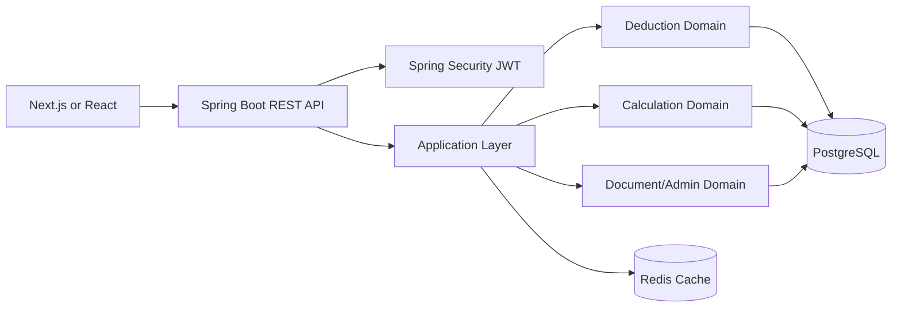

# 연말정산 공제 시뮬레이터 설계 초안

## 1. 프로젝트 한 줄 소개
연말정산 공제 시뮬레이터는 복잡한 공제 규칙과 세액 계산 과정을 `판정`과 `계산`으로 분리해, 예상 세액/환급뿐 아니라 적용 근거까지 설명하는 규칙 기반 백엔드 시스템이다.

## 2. 핵심 설계 포인트
### 2-1. 규칙 판정과 계산을 분리한다
- `DeductionPolicy`: 공제 항목별 규칙을 평가한다.
- `EligibilityChecker`: 사람/가족/소득/지출이 공제 대상인지 판정한다.
- `TaxCalculationService`: 판정 결과를 바탕으로 세액과 환급액을 계산한다.

이렇게 나누는 이유는 "의료비 공제가 가능한가?"와 "가능한 금액으로 최종 세액이 얼마가 되는가?"가 서로 다른 책임이기 때문이다. 둘을 한 서비스에 섞으면 규칙 변경 때 회귀 범위가 커지고, 설명 가능한 결과를 만들기 어렵다.

### 2-2. 세법 개정에 대응할 수 있어야 한다
- 모든 계산은 `taxYear`와 `ruleVersion`을 기준으로 수행한다.
- `deduction_rules` 테이블에 연도별 규칙 메타데이터를 저장한다.
- 실제 복잡한 계산식은 코드로 구현하되, 규칙 설명/버전/한도/활성 여부는 DB에 저장한다.

이 구조를 쓰면 "2025년 규칙으로 계산한 결과"와 "2026년 개정 규칙으로 다시 계산한 결과"를 분리해 보관할 수 있다.

### 2-3. 결과가 설명 가능해야 한다
- 각 공제 항목마다 `appliedReason`, `rejectedReason`, `eligibleAmount`, `limitAppliedAmount`를 남긴다.
- 최종 계산 결과에는 단계별 계산 로그(`trace`)를 저장한다.

포트폴리오 관점에서 중요한 포인트는 "계산했다"가 아니라 "왜 이렇게 계산됐는지 시스템이 설명할 수 있다"는 점이다.

### 2-4. 입력 데이터는 세션 스냅샷으로 다룬다
- `tax_sessions`를 연말정산 계산의 기준 단위로 둔다.
- 부양가족, 소득, 지출은 사용자 프로필의 실시간 값이 아니라 세션 시점의 스냅샷으로 저장한다.

이렇게 해야 추후 사용자가 프로필을 수정해도 이미 계산된 연도별 결과가 깨지지 않는다.

### 2-5. 처음부터 범용 룰 엔진 DSL로 가지 않는다
- 1차 구현은 Strategy/Policy 기반의 코드 중심 규칙 엔진으로 간다.
- DB에는 메타데이터와 버전 정보만 저장한다.

범용 룰 DSL은 멋있어 보이지만, 1년차 포트폴리오에서는 구현 복잡도 대비 유지보수 이점이 크지 않다. 오히려 "복잡한 규칙을 읽기 쉬운 코드로 나눠 설계했다"가 더 강한 메시지다.

## 3. 전체 아키텍처


### 3-1. 계층 구조
- Presentation: Controller, Swagger/OpenAPI
- Application: UseCase, Facade, Transaction, 권한 체크
- Domain: Entity, Aggregate, Policy, Checker, Domain Service
- Infrastructure: JPA Repository, Redis, Security, External Adapter

### 3-2. 추천 모노레포 구조
```text
year-end/
  backend/
  frontend/
  docs/
  docker-compose.yml
```

처음 시작은 모노레포가 관리하기 쉽다. 백엔드/프론트 버전 동기화와 README 관리가 편하고, 포트폴리오에서도 전체 구조를 보여주기 좋다.

### 3-3. 실행 흐름
1. 사용자가 `tax_session`을 생성한다.
2. 기본 정보, 부양가족, 소득, 지출/공제 자료를 입력한다.
3. `CalculationFacade`가 세션 데이터를 `TaxContext`로 조립한다.
4. `DeductionPolicy`들이 각 공제 항목을 평가한다.
5. `TaxCalculationService`가 판정 결과를 모아 세액/환급액을 계산한다.
6. `CalculationResult`와 설명 로그를 저장한다.
7. 관리자는 문서 체크리스트와 검토 상태를 갱신한다.

## 4. 도메인 모델
### 4-1. 주요 Aggregate
#### User
- 역할: 인증 주체, 사용자 기본 정보 보유
- 주요 필드: `id`, `email`, `passwordHash`, `name`, `role`, `createdAt`

#### TaxSession
- Aggregate Root
- 역할: 특정 연도에 대한 연말정산 입력/계산의 기준 단위
- 주요 필드: `id`, `userId`, `taxYear`, `status`, `filingType`, `createdAt`, `updatedAt`
- 하위 개념: `BasicInfo`, `Dependent`, `IncomeItem`, `DeductionItem`

#### CalculationResult
- 역할: 계산 결과와 설명 로그 보관
- 주요 필드: `taxSessionId`, `grossIncome`, `taxableIncome`, `totalDeduction`, `taxCredit`, `finalTax`, `expectedRefund`, `traceJson`

#### DocumentChecklist
- 역할: 관리자 검토용 제출 서류 상태 관리
- 주요 필드: `taxSessionId`, `documentType`, `required`, `submitted`, `reviewStatus`, `comment`

### 4-2. Value Object 예시
- `Money`: 금액 연산 일관성 보장
- `TaxYear`: 연도별 규칙 버전 처리
- `DeductionType`: 의료비, 교육비, 보험료, 기부금 등
- `EligibilityResult`: 가능 여부 + 사유 + 제한 금액
- `CalculationTraceStep`: 계산 단계명 + 입력값 + 결과값 + 설명

### 4-3. 도메인 객체 관계
- `User` 1:N `TaxSession`
- `TaxSession` 1:N `Dependent`
- `TaxSession` 1:N `IncomeItem`
- `TaxSession` 1:N `DeductionItem`
- `TaxSession` 1:1 `CalculationResult`
- `TaxSession` 1:N `DocumentChecklist`

### 4-4. 왜 세션 중심 모델이 좋은가
- 계산 단위를 명확히 묶을 수 있다.
- 세법 개정, 재계산, 검토 이력을 세션 단위로 관리할 수 있다.
- 실무에서 "한 사용자의 프로필"보다 "한 신고/한 신청/한 주문" 같은 업무 단위 Aggregate가 더 안정적이다.

## 5. 패키지 구조
```text
com.example.yearend
  common
    config
    exception
    security
    response
    util
  user
    api
    application
    domain
    infrastructure
  taxsession
    api
    application
    domain
    infrastructure
  deduction
    api
    application
    domain
      model
      policy
      checker
      result
    infrastructure
  calculation
    api
    application
    domain
    infrastructure
  document
    api
    application
    domain
    infrastructure
  admin
    api
    application
    domain
    infrastructure
```

### 5-1. 구현 시 클래스 예시
```text
deduction/domain/policy/
  DeductionPolicy.java
  MedicalExpenseDeductionPolicy.java
  EducationDeductionPolicy.java
  InsuranceDeductionPolicy.java
  DonationDeductionPolicy.java

deduction/domain/checker/
  EligibilityChecker.java
  DependentIncomeChecker.java
  AgeRequirementChecker.java
  ResidencyChecker.java

calculation/domain/
  TaxCalculationService.java
  ProgressiveTaxCalculator.java
  TaxCreditCalculator.java
  RefundCalculator.java
```

패키지는 "기능 기준"으로 나누고, 각 기능 안에서 `api/application/domain/infrastructure`로 한 번 더 나누는 편이 규모가 커져도 버티기 좋다.

## 6. API 초안
### 6-1. 인증/사용자
- `POST /api/v1/auth/signup`
- `POST /api/v1/auth/login`
- `POST /api/v1/auth/refresh`
- `GET /api/v1/users/me`

### 6-2. 세션 입력
- `POST /api/v1/tax-sessions`
  - 설명: 연말정산 세션 생성
  - 요청 예시:
```json
{
  "taxYear": 2025,
  "filingType": "SALARY_WORKER"
}
```

- `GET /api/v1/tax-sessions/{sessionId}`
- `PATCH /api/v1/tax-sessions/{sessionId}/basic-info`
- `POST /api/v1/tax-sessions/{sessionId}/dependents`
- `POST /api/v1/tax-sessions/{sessionId}/income-items`
- `POST /api/v1/tax-sessions/{sessionId}/deduction-items`

### 6-3. 계산/설명
- `POST /api/v1/tax-sessions/{sessionId}/calculate`
  - 설명: 공제 판정 + 세액 계산 실행

- `GET /api/v1/tax-sessions/{sessionId}/results`
  - 응답 예시:
```json
{
  "taxSessionId": "uuid",
  "taxYear": 2025,
  "grossIncome": 58000000,
  "totalDeduction": 7200000,
  "taxCredit": 1250000,
  "finalTax": 2150000,
  "withholdingTax": 2600000,
  "expectedRefund": 450000,
  "appliedItems": [
    {
      "deductionType": "MEDICAL",
      "eligibleAmount": 1200000,
      "appliedReason": "총급여 기준 공제 요건 충족"
    }
  ],
  "rejectedItems": [
    {
      "deductionType": "DEPENDENT",
      "rejectedReason": "부양가족 소득 요건 초과"
    }
  ]
}
```

- `GET /api/v1/tax-sessions/{sessionId}/explanations`

### 6-4. 관리자
- `GET /api/v1/admin/tax-sessions?status=SUBMITTED`
- `PATCH /api/v1/admin/tax-sessions/{sessionId}/review-status`
- `POST /api/v1/admin/tax-sessions/{sessionId}/document-checklists`
- `PATCH /api/v1/admin/document-checklists/{checklistId}`

### 6-5. API 설계 원칙
- 입력 API와 계산 API를 분리한다.
- 계산은 멱등성 있게 설계한다. 같은 세션/같은 규칙 버전이면 결과가 동일해야 한다.
- 조회 응답은 "결과값"과 "설명"을 함께 준다.

## 7. 규칙/계산 엔진 설계
### 7-1. 핵심 인터페이스
```java
public interface DeductionPolicy {
    DeductionType supports();
    DeductionEvaluation evaluate(TaxContext context, DeductionItem item, DeductionRuleSnapshot rule);
}

public interface EligibilityChecker {
    EligibilityResult check(TaxContext context, DeductionItem item);
}

public interface TaxCalculationService {
    CalculationResult calculate(TaxContext context, List<DeductionEvaluation> evaluations);
}
```

### 7-2. 추천 처리 순서
1. `TaxContextFactory`가 세션 데이터를 불변 객체로 조립한다.
2. 공제 항목별로 `DeductionPolicy`를 찾는다.
3. 각 `DeductionPolicy` 내부에서 필요한 `EligibilityChecker`를 조합해 판정한다.
4. 판정 성공 시 `eligibleAmount`와 `limitAppliedAmount`를 계산한다.
5. `TaxCalculationService`가 과세표준, 산출세액, 세액공제, 결정세액, 환급액을 순서대로 계산한다.
6. 모든 단계의 근거를 `CalculationTrace`에 기록한다.

### 7-3. 추천 클래스 구조
```text
CalculationFacade
  -> TaxContextFactory
  -> DeductionPolicyRegistry
  -> DeductionEvaluationService
  -> TaxCalculationService
  -> CalculationResultRepository
```

### 7-4. 예시 구현 아이디어
```java
@Component
public class MedicalExpenseDeductionPolicy implements DeductionPolicy {

    private final List<EligibilityChecker> checkers;

    @Override
    public DeductionType supports() {
        return DeductionType.MEDICAL;
    }

    @Override
    public DeductionEvaluation evaluate(TaxContext context, DeductionItem item, DeductionRuleSnapshot rule) {
        for (EligibilityChecker checker : checkers) {
            EligibilityResult result = checker.check(context, item);
            if (!result.isEligible()) {
                return DeductionEvaluation.rejected(item.getId(), result.reason());
            }
        }

        long eligibleAmount = Math.min(item.getAmount(), rule.maxLimit());
        return DeductionEvaluation.applied(item.getId(), eligibleAmount, "의료비 공제 요건 충족");
    }
}
```

### 7-5. 왜 이 구조가 실무적이냐
- 공제 항목이 늘어나도 새 `Policy` 클래스를 추가하면 된다.
- 하나의 거대한 `if-else` 계산 서비스보다 테스트가 훨씬 쉽다.
- 규칙 판정과 수식 계산이 분리되어 버그 위치를 좁히기 쉽다.

### 7-6. 추가 권장 사항
- 규칙 메타데이터는 `DeductionRuleSnapshot`으로 계산 시점에 고정한다.
- 계산 결과는 재현 가능해야 하므로 "계산 당시 사용한 규칙 버전"을 함께 저장한다.
- 설명 문자열은 하드코딩만 하지 말고 `reasonCode`도 함께 저장해 프론트/관리자에서 재활용 가능하게 만든다.

## 8. DB 설계
### 8-1. 핵심 테이블
#### users
| 컬럼 | 타입 | 설명 |
|---|---|---|
| id | UUID PK | 사용자 식별자 |
| email | VARCHAR(255) UNIQUE | 로그인 ID |
| password_hash | VARCHAR(255) | 암호화된 비밀번호 |
| name | VARCHAR(100) | 이름 |
| role | VARCHAR(30) | USER, ADMIN |
| created_at | TIMESTAMP | 생성일시 |

#### tax_sessions
| 컬럼 | 타입 | 설명 |
|---|---|---|
| id | UUID PK | 세션 식별자 |
| user_id | UUID FK | 사용자 FK |
| tax_year | INT | 귀속 연도 |
| status | VARCHAR(30) | DRAFT, SUBMITTED, REVIEWED, CALCULATED |
| filing_type | VARCHAR(30) | 신고 유형 |
| withholding_tax | BIGINT | 기납부세액 |
| rule_version | VARCHAR(50) | 사용 규칙 버전 |
| created_at | TIMESTAMP | 생성일시 |
| updated_at | TIMESTAMP | 수정일시 |

#### dependents
| 컬럼 | 타입 | 설명 |
|---|---|---|
| id | UUID PK | 부양가족 식별자 |
| tax_session_id | UUID FK | 세션 FK |
| name | VARCHAR(100) | 이름 |
| relation_type | VARCHAR(30) | 배우자, 자녀, 부모 등 |
| birth_date | DATE | 생년월일 |
| income_amount | BIGINT | 연간 소득 |
| disability_yn | BOOLEAN | 장애인 여부 |
| cohabitation_yn | BOOLEAN | 동거 여부 |

#### income_items
| 컬럼 | 타입 | 설명 |
|---|---|---|
| id | UUID PK | 소득 항목 식별자 |
| tax_session_id | UUID FK | 세션 FK |
| income_type | VARCHAR(30) | 근로, 기타소득 등 |
| source_name | VARCHAR(100) | 지급처 |
| annual_amount | BIGINT | 총액 |
| taxable_amount | BIGINT | 과세 대상 금액 |
| withholding_tax | BIGINT | 원천징수세액 |
| attributes_json | JSONB | 확장 필드 |

#### deduction_items
| 컬럼 | 타입 | 설명 |
|---|---|---|
| id | UUID PK | 공제 입력 항목 식별자 |
| tax_session_id | UUID FK | 세션 FK |
| deduction_type | VARCHAR(30) | 공제 종류 |
| amount | BIGINT | 사용 금액 |
| spent_at | DATE | 지출일 |
| provider_name | VARCHAR(100) | 기관/가맹점 |
| input_source | VARCHAR(30) | MANUAL, IMPORT |
| attributes_json | JSONB | 항목별 추가 정보 |

#### deduction_rules
| 컬럼 | 타입 | 설명 |
|---|---|---|
| id | UUID PK | 규칙 식별자 |
| tax_year | INT | 적용 연도 |
| rule_code | VARCHAR(50) | 규칙 코드 |
| rule_name | VARCHAR(100) | 규칙명 |
| deduction_type | VARCHAR(30) | 공제 종류 |
| version | VARCHAR(50) | 버전 |
| max_limit | BIGINT | 최대 한도 |
| condition_json | JSONB | 메타 조건 |
| effective_from | DATE | 적용 시작일 |
| effective_to | DATE | 적용 종료일 |
| is_active | BOOLEAN | 활성 여부 |

#### calculation_results
| 컬럼 | 타입 | 설명 |
|---|---|---|
| id | UUID PK | 결과 식별자 |
| tax_session_id | UUID FK UNIQUE | 세션 FK |
| gross_income | BIGINT | 총소득 |
| taxable_income | BIGINT | 과세표준 |
| total_deduction | BIGINT | 총공제액 |
| tax_credit | BIGINT | 세액공제 |
| calculated_tax | BIGINT | 산출세액 |
| final_tax | BIGINT | 결정세액 |
| expected_refund | BIGINT | 예상 환급액 |
| trace_json | JSONB | 계산 단계 로그 |
| created_at | TIMESTAMP | 생성일시 |

#### document_checklists
| 컬럼 | 타입 | 설명 |
|---|---|---|
| id | UUID PK | 체크리스트 식별자 |
| tax_session_id | UUID FK | 세션 FK |
| document_type | VARCHAR(50) | 서류 종류 |
| required_yn | BOOLEAN | 필요 여부 |
| submitted_yn | BOOLEAN | 제출 여부 |
| review_status | VARCHAR(30) | PENDING, OK, REJECTED |
| comment | VARCHAR(500) | 검토 메모 |
| checked_by | UUID | 관리자 ID |
| checked_at | TIMESTAMP | 검토 일시 |

### 8-2. 인덱스 추천
- `users(email)` UNIQUE
- `tax_sessions(user_id, tax_year)`
- `dependents(tax_session_id)`
- `income_items(tax_session_id, income_type)`
- `deduction_items(tax_session_id, deduction_type)`
- `deduction_rules(tax_year, deduction_type, is_active)`
- `document_checklists(tax_session_id, review_status)`

### 8-3. 설계 메모
- `JSONB`는 가변 속성이 많은 항목에만 제한적으로 쓴다.
- 주민등록번호 같은 민감정보는 가능하면 저장하지 않고, 정말 필요하면 암호화 컬럼으로 분리한다.
- `calculation_results`는 계산 결과 재현을 위해 입력 요약이나 규칙 버전도 함께 저장하는 것이 좋다.

## 9. 보안 설계
### 9-1. 인증/인가
- Spring Security + JWT Access/Refresh Token
- 권한은 최소 `USER`, `ADMIN` 두 가지로 시작
- 모든 세션/결과 조회는 `session.userId == currentUserId` 검증

### 9-2. 민감정보 보호
- 비밀번호는 `BCrypt` 또는 `Argon2` 해시
- 민감정보는 저장 자체를 최소화
- 필요한 경우 JPA Converter 또는 DB 암호화로 컬럼 암호화

### 9-3. 운영 보안
- Swagger는 운영 환경에서 인증된 관리자만 접근
- 관리자 액션은 감사 로그 남기기
- 로그인/계산 API는 Redis 기반 rate limiting 고려
- GitHub Actions 시크릿으로 DB, JWT, 배포 키 관리

### 9-4. 실무적으로 중요한 점
연말정산 데이터는 개인정보와 금액 정보가 많아 CRUD보다 보안 설계가 훨씬 중요하다. 포트폴리오에서도 "왜 전체 주민번호를 저장하지 않았는지", "왜 관리자 액션을 로그로 남겼는지"를 설명할 수 있어야 한다.

## 10. 테스트 전략
### 10-1. 단위 테스트
- `DeductionPolicy`별 판정 테스트
- `EligibilityChecker`별 경계값 테스트
- `TaxCalculationService` 계산 공식 테스트
- 세법 연도별 규칙 버전 테스트

### 10-2. 통합 테스트
- `@DataJpaTest`로 Repository 검증
- `@SpringBootTest`로 계산 플로우 검증
- 가능하면 Testcontainers로 PostgreSQL/Redis 실환경 유사 테스트

### 10-3. API 테스트
- `@WebMvcTest` 또는 RestAssured로 인증/인가/응답 포맷 검증
- Swagger 스펙과 실제 응답 필드가 어긋나지 않는지 확인

### 10-4. 추천 시나리오 테스트
- 부양가족 소득 기준 초과 케이스
- 의료비는 가능하지만 한도 초과 케이스
- 기납부세액이 더 커서 환급되는 케이스
- 서류 누락으로 관리자 검토 보류되는 케이스

### 10-5. 테스트 우선순위
1. 계산식과 판정 로직 단위 테스트
2. 계산 전체 플로우 통합 테스트
3. 인증/인가 테스트
4. 관리자 검토 플로우 테스트

## 11. README/문서화 가이드
README에는 아래 내용을 반드시 넣는 것이 좋다.

### 11-1. 필수 항목
- 프로젝트 소개
- 왜 이 프로젝트를 만들었는지
- 핵심 기능
- 기술 스택
- 아키텍처 다이어그램
- 실행 방법(Docker Compose 포함)
- 환경 변수 설명
- API 문서 위치
- 테스트 실행 방법

### 11-2. 문서 폴더 추천
```text
docs/
  architecture.md
  api.md
  erd.md
  domain-rules.md
  adr/
    0001-policy-based-rule-engine.md
    0002-session-snapshot-model.md
```

### 11-3. 꼭 문서화할 내용
- 공제 규칙이 코드에서 어디에 구현돼 있는지
- 세법 개정 시 어떤 순서로 수정하면 되는지
- 결과 설명이 어떤 구조로 생성되는지
- 관리자 검토 기능이 왜 필요한지

포트폴리오에서는 "코드"만큼 "설명 문서"가 중요하다. 면접관은 완성도보다 생각의 구조를 많이 본다.

## 12. 6주 개발 로드맵
### 1주차
- 모노레포 구조 생성
- Spring Boot/Next.js 초기 세팅
- Docker Compose로 PostgreSQL/Redis 구성
- JWT 인증/인가 기본 구조 구현
- Swagger/OpenAPI 연동

### 2주차
- `users`, `tax_sessions`, `dependents`, `income_items`, `deduction_items` 스키마 구현
- 세션 생성/입력 API 구현
- 기본 예외 처리와 공통 응답 포맷 정리

### 3주차
- `DeductionPolicy`, `EligibilityChecker` 인터페이스 구현
- 의료비, 교육비, 보험료 정도까지 MVP 규칙 구현
- 규칙 판정 결과 DTO와 설명 구조 설계

### 4주차
- `TaxCalculationService` 구현
- 과세표준, 산출세액, 세액공제, 환급액 계산 플로우 완성
- `calculation_results` 저장 및 결과 조회 API 구현

### 5주차
- 관리자 검토/문서 체크리스트 기능 구현
- Redis 캐시 적용(자주 조회되는 계산 결과 캐시)
- 테스트 보강과 예시 시나리오 데이터 작성

### 6주차
- 프론트에서 입력/결과/설명 화면 연결
- GitHub Actions CI/CD 구축
- README, ERD, ADR, API 문서 정리
- 포트폴리오용 발표 자료/면접 답변 정리

## 13. 면접에서 강조할 포인트
### 13-1. 왜 이 프로젝트가 CRUD가 아닌가
- 공제 가능 여부 판정과 세액 계산이 분리돼 있다.
- 규칙 변경에 대응하기 위한 연도/버전 개념이 있다.
- 결과값뿐 아니라 적용 사유/미적용 사유를 제공한다.

### 13-2. 아키텍처적으로 보여줄 강점
- 도메인 중심으로 책임을 나눴다.
- 변경 가능성이 높은 규칙 영역을 `Policy`로 격리했다.
- 세션 스냅샷 모델로 재계산과 이력 보존을 가능하게 했다.

### 13-3. 실무형 질문에 대한 답변 포인트
- "세법이 바뀌면 어디를 수정하나요?"
  - 규칙 메타데이터와 해당 `Policy` 구현을 수정하고, 연도별 테스트를 추가한다.
- "왜 범용 룰 엔진 대신 코드 기반으로 갔나요?"
  - 현재 요구사항과 팀 규모에서 가독성/디버깅/테스트 용이성이 더 중요했기 때문이다.
- "왜 설명 가능한 결과가 중요하나요?"
  - 세무 도메인은 사용자와 관리자 모두 결과 근거를 확인해야 신뢰할 수 있기 때문이다.

## 14. 1년차 개발자 관점에서 같이 정리할 내용
### 14-1. 이번 작업에서 새로 배우게 되는 개념
- DDD의 Aggregate와 Value Object
- Strategy/Policy 패턴
- Snapshot 모델링
- 규칙 판정과 계산 분리
- 설명 가능한 시스템(Explainable System) 설계

### 14-2. 왜 이런 구조를 쓰는지
- 복잡한 업무 규칙은 한 클래스에 몰아넣는 순간 유지보수가 급격히 어려워진다.
- "판정", "계산", "설명", "저장"을 나누면 수정 범위가 작아진다.
- 테스트 대상이 잘게 나뉘어 버그를 빨리 찾을 수 있다.

### 14-3. 실무에서 자주 쓰는 이유
- 정책/규칙은 자주 바뀌기 때문이다.
- 사용자 입력은 계속 변하지만, 과거 계산 결과는 보존해야 하기 때문이다.
- 관리자 검토, 감사 로그, 권한 분리 같은 운영 요구가 항상 따라오기 때문이다.

### 14-4. 내가 놓치기 쉬운 포인트
- 금액 계산 시 `double` 대신 정수/`BigDecimal` 사용
- 연도별 규칙 차이를 하드코딩 하나로 덮지 않기
- 설명 문구만 저장하지 말고 코드값(`reasonCode`)도 함께 남기기
- 사용자 프로필과 세션 스냅샷을 섞지 않기
- 테스트에서 정상 케이스만 보지 말고 경계값/실패 케이스도 보기

### 14-5. 더 공부할 키워드 3~5개
- Domain-Driven Design
- Strategy Pattern
- Aggregate / Snapshot Modeling
- Testcontainers
- Architecture Decision Record(ADR)

## 마무리 제안
이 프로젝트는 처음부터 모든 연말정산 규칙을 다 구현하려고 하기보다, "구조가 맞는가"를 먼저 보여주는 것이 중요하다.  
포트폴리오 1차 목표는 아래 3가지를 분명하게 보여주는 것이다.

1. 복잡한 규칙을 코드 구조로 풀어냈다.
2. 결과를 설명할 수 있다.
3. 세법 변경에도 버틸 수 있게 설계했다.
